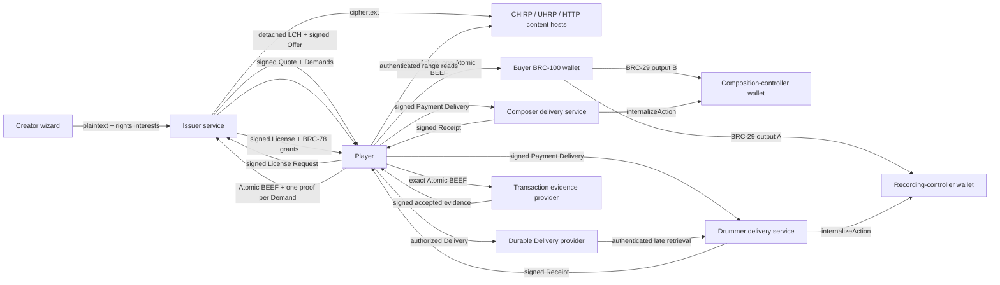

# LCH reference deployment

## Roles and data flow



Money is received by the Payee wallets named in the signed Payment Demands. `WalletPaymentReceiver` derives the expected receiving key with BRC-29, validates the exact finalized output, and calls that Payee wallet's BRC-100 `internalizeAction`. The issuer only receives value when it is explicitly one of the Payees. The reference split is 7 satoshis to the recording controller and 5 satoshis to the composition controller. Under authorized-output settlement, License issuance can precede the Payee wallet call, but the value is still locked to the exact Payee-derived script; the durable provider retains the Delivery so that wallet can internalize the same output later.

The issuer endpoint is `${PUBLIC_BASE_URL}/api/lch`. The two reference Payees deliberately publish different delivery paths, `${PUBLIC_BASE_URL}/api/lch/payees/recording` and `${PUBLIC_BASE_URL}/api/lch/payees/composition`. The authorized-output fixture also exposes `${PUBLIC_BASE_URL}/api/lch/evidence`, `${PUBLIC_BASE_URL}/api/lch/delivery-store`, and `${PUBLIC_BASE_URL}/api/lch/delivery-retrieval`. They share a process and fixture issuer identity only to keep every role runnable and inspectable. A deployed Demand can name `https://payments.drummer.example/lch`, authorize `https://availability.drummer.example/lch`, and use `https://processor.example/evidence`, while the downstream work uses `https://licenses.publisher.example/lch`. None of those origins receives or controls another role's wallet merely because the evidence appears in one completion.

`receipt-complete-v1` keeps the narrowest trust boundary: no License until the Payee wallet validates, internalizes, and signs. `authorized-output-v1` improves post-payment availability by letting the Payee pre-authorize an exact destination plus independent evidence and storage providers. It exposes more linkable metadata, depends on those providers, accepts processor policy before mining, and can release keys before wallet internalization. An offline Payee without that explicit Authorization remains pending. Production UIs should present that choice to the Payee when configuring its Demand service, not silently select fallback for buyers.

## HTTP surface

The executable Node server exposes:

| Method | Path                          | Purpose                                                                                       |
| ------ | ----------------------------- | --------------------------------------------------------------------------------------------- |
| `GET`  | `/api/health`                 | Wallet mode and acquisition endpoint                                                          |
| `POST` | `/api/assets`                 | Creator publication input (`name`, `mediaType`, base64 bytes); returns IDs and `lchBase64url` |
| `POST` | `/api/lch`                    | Issuer preflight, Quote, completion, and recovery                                             |
| `POST` | `/api/lch/payees/{interest}`  | Independently routed Payee preflight and Payment Delivery                                     |
| `POST` | `/api/lch/evidence`           | Exact-transaction evaluation and signed accepted evidence                                     |
| `POST` | `/api/lch/delivery-store`     | Durable signed Delivery storage and retention acknowledgement                                 |
| `POST` | `/api/lch/delivery-retrieval` | Payee-signed authenticated retrieval of its stored Delivery                                   |
| `GET`  | `/content/{sha256}`           | Detached ciphertext, including one HTTP byte range                                            |
| `GET`  | `/*`                          | Reference workbench and third-party notices                                                   |

The endpoints accept only their role-appropriate exact media types implemented by `LCHHttpServer`. Bodies are bounded and error responses use stable LCH error codes. Sending a drummer Demand to the composition endpoint, a Delivery to the evidence endpoint, or a retrieval request signed by another identity fails even in the collapsed fixture topology.

Publication example:

```sh
curl -H 'content-type: application/json' \
  --data '{"name":"clip.wav","mediaType":"audio/wav","bytesBase64":"..."}' \
  https://lch.example/api/assets
```

## Wallet module

Without `LCH_WALLET_MODULE`, the server reports `walletMode: "fixture"`. A connected deployment sets it to a self-contained ESM module exporting:

```js
export async function createLCHWallets() {
  return {
    issuerWallet: await openBRC100Wallet('issuer'),
    recordingWallet: await openBRC100Wallet('recording-controller'),
    compositionWallet: await openBRC100Wallet('composition-controller')
  }
}
```

Every value must implement the BRC-100 `WalletInterface`. The issuer wallet signs Offers, Quotes, Licenses, and BRC-78 key envelopes. The two Payee wallets sign their Demands and Receipts and receive funds through `internalizeAction`. A player supplies its own `WalletClient` or other `WalletInterface` to `ReferenceLCHClient`; its `createAction` is the only transaction-creation boundary.

The module belongs in the operator's secret-bearing runtime, not in the public image. It may open local wallet-toolbox instances, connect to separately isolated BRC-100 wallet services, or wrap another conforming wallet substrate. Run each financial role with an independently controlled identity in deployments that require separate accounting or authority. A federated deployment normally runs a separate wallet module and Payment Ledger beside each Payee endpoint rather than loading every wallet into the issuer process.

## Content storage

`ReferenceContentStore` keeps ciphertext in process so the complete protocol can run with no external dependency. A deployed issuer replaces it at the `ContentSink`/`ContentSource` boundary:

- `CHIRPContentSink` publishes chunked, merklized ciphertext and returns a `chirp://` locator.
- `UHRPContentSink` preserves the existing UHRP publication path.
- `UniversalContentSource` resolves CHIRP, UHRP, and bounded HTTPS locators and verifies the exact ciphertext digest and length declared by the LCH Asset Body.

The LCH header, Offer, Quote, License, and content locator remain independent of which conforming host retains the ciphertext. Multiple locators can be declared for partial or redundant hosting when the applicable storage profile defines that behavior.

## Deployment shapes

The single-process server is the smallest executable topology. It contains the static workbench, issuer handlers, independently routed Payee handlers, and reference content store. It is appropriate for protocol development and interoperability testing.

A durable topology separates four concerns:

1. Stateless issuer/API replicas terminate the Offer endpoint and persist Requests, Quotes, completion state, Licenses, and wrapped content-encryption keys.
2. Every Payee operates its signed Demand endpoint, atomic Payment Ledger, Demand and Authorization state, and BRC-100 receiving wallet independently.
3. Authorized Delivery providers atomically store exact signed Deliveries through their promised recovery deadlines; evidence providers atomically bind each Authorization to one accepted transaction under the named policy.
4. The buyer persists the funded Atomic BEEF, signed Deliveries, Receipts, Authorizations, and fallback evidence before fan-out and until License recovery completes or `recoveryUntil` passes.
5. CHIRP/UHRP providers retain ciphertext; the issuer retains only locators and verified metadata.

The Payment Ledger and Authorization-to-transaction claims must be atomic across replicas. The same Demand and transaction must return the same Receipt or evidence; a second transaction for that Demand or Authorization must fail. Stored Deliveries must survive process and zone loss through `availableUntil`. Content-encryption keys and wallet credentials require encryption at rest, access separation, backup, rotation, and audit controls appropriate to the deployment.

The reference client records the wallet result as **finalized** only. The initial authorized-output evidence provider can separately sign **accepted** under `signed-processor-acceptance-v1`; it does not claim broadcast or mined state. A mined profile needs explicit SPV evidence. If direct and authorized fallback delivery fail after finalization, the application retains the transaction and all partial proofs and presents a pending settlement through `recoveryUntil`; it does not offer a second purchase action.

`LCHAcquisitionTransport` lets a buyer route those same operations through an application-owned asynchronous inbox or message-box adapter. The BRC-170 v1 portable wire binding remains deterministic-CBOR HTTP. A gateway can enqueue internally while preserving the exact acknowledgement, identity, retention, and recovery contract. A native message-box protocol needs a separately registered profile defining addressing, authentication, correlation, reply polling, expiry, retention, and replay behavior; the adapter cannot silently replace signed Deliveries, Receipts, Authorizations, or provider evidence.

## Container reference

Build from the TS Stack repository root:

```sh
docker build -f apps/lch-reference/Dockerfile -t lch-reference .
docker run --read-only --tmpfs /tmp -p 4173:4173 \
  -e LCH_PUBLIC_BASE_URL=https://lch.example \
  -e LCH_WALLET_MODULE=/run/lch-wallets/operator-wallets.mjs \
  -v /operator/lch-wallets:/run/lch-wallets:ro \
  lch-reference
```

Terminate TLS at the ingress, set `LCH_PUBLIC_BASE_URL` to the public HTTPS origin, and restrict publication to authenticated creator/admin traffic before exposing `/api/assets`. The reference route deliberately contains no account system because creator authentication is an application policy, not an LCH wire object.
