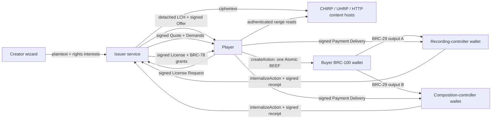

# LCH reference deployment

## Roles and data flow



Money is received by the Payee wallets named in the signed Payment Demands. `WalletPaymentReceiver` derives the expected receiving key with BRC-29, validates the exact finalized output, and calls that Payee wallet's BRC-100 `internalizeAction`. The issuer only receives value when it is explicitly one of the Payees. The reference split is 7 satoshis to the recording controller and 5 satoshis to the composition controller.

## HTTP surface

The executable Node server exposes:

| Method | Path                | Purpose                                                                                       |
| ------ | ------------------- | --------------------------------------------------------------------------------------------- |
| `GET`  | `/api/health`       | Wallet mode and acquisition endpoint                                                          |
| `POST` | `/api/assets`       | Creator publication input (`name`, `mediaType`, base64 bytes); returns IDs and `lchBase64url` |
| `POST` | `/api/lch`          | Deterministic-CBOR LCH acquisition binding                                                    |
| `GET`  | `/content/{sha256}` | Detached ciphertext, including one HTTP byte range                                            |
| `GET`  | `/*`                | Reference workbench and third-party notices                                                   |

The acquisition endpoint accepts the exact media types implemented by `LCHHttpServer`: license-request preflight, License Request, Payment Demand preflight, Payment Delivery, Payment Completion, and license recovery. Bodies are bounded and error responses use stable LCH error codes.

Publication example:

```sh
curl -H 'content-type: application/json' \
  --data '{"name":"clip.wav","mediaType":"audio/wav","bytesBase64":"..."}' \
  https://lch.example/api/assets
```

## Wallet module

Without `LCH_WALLET_MODULE`, the server reports `walletMode: "fixture"`. A connected deployment sets it to a self-contained ESM module exporting:

```js
export async function createLCHWallets() {
  return {
    issuerWallet: await openBRC100Wallet('issuer'),
    recordingWallet: await openBRC100Wallet('recording-controller'),
    compositionWallet: await openBRC100Wallet('composition-controller')
  }
}
```

Every value must implement the BRC-100 `WalletInterface`. The issuer wallet signs Offers, Quotes, Licenses, and BRC-78 key envelopes. The two Payee wallets sign their Demands and Receipts and receive funds through `internalizeAction`. A player supplies its own `WalletClient` or other `WalletInterface` to `ReferenceLCHClient`; its `createAction` is the only transaction-creation boundary.

The module belongs in the operator's secret-bearing runtime, not in the public image. It may open local wallet-toolbox instances, connect to separately isolated BRC-100 wallet services, or wrap another conforming wallet substrate. Run each financial role with an independently controlled identity in deployments that require separate accounting or authority.

## Content storage

`ReferenceContentStore` keeps ciphertext in process so the complete protocol can run with no external dependency. A deployed issuer replaces it at the `ContentSink`/`ContentSource` boundary:

- `CHIRPContentSink` publishes chunked, merklized ciphertext and returns a `chirp://` locator.
- `UHRPContentSink` preserves the existing UHRP publication path.
- `UniversalContentSource` resolves CHIRP, UHRP, and bounded HTTPS locators and verifies the exact ciphertext digest and length declared by the LCH Asset Body.

The LCH header, Offer, Quote, License, and content locator remain independent of which conforming host retains the ciphertext. Multiple locators can be declared for partial or redundant hosting when the applicable storage profile defines that behavior.

## Deployment shapes

The single-process server is the smallest executable topology. It contains the static workbench, issuer handlers, Payee handlers, and reference content store. It is appropriate for protocol development and interoperability testing.

A durable topology separates four concerns:

1. Stateless issuer/API replicas terminate the LCH HTTP binding.
2. A transactional store holds request IDs, immutable Quotes/Demands, Payment Ledger claims, receipts, issued Licenses, and wrapped content-encryption keys.
3. Each Payee role calls its independently operated BRC-100 wallet service.
4. CHIRP/UHRP providers retain ciphertext; the API retains only locators and verified metadata.

The Payment Ledger claim must be atomic across replicas. The same Demand and same finalized transaction must return the same Receipt; a second transaction for that Demand must fail. Content-encryption keys and wallet credentials require encryption at rest, access separation, backup, rotation, and audit controls appropriate to the deployment.

## Container reference

Build from the TS Stack repository root:

```sh
docker build -f apps/lch-reference/Dockerfile -t lch-reference .
docker run --read-only --tmpfs /tmp -p 4173:4173 \
  -e LCH_PUBLIC_BASE_URL=https://lch.example \
  -e LCH_WALLET_MODULE=/run/lch-wallets/operator-wallets.mjs \
  -v /operator/lch-wallets:/run/lch-wallets:ro \
  lch-reference
```

Terminate TLS at the ingress, set `LCH_PUBLIC_BASE_URL` to the public HTTPS origin, and restrict publication to authenticated creator/admin traffic before exposing `/api/assets`. The reference route deliberately contains no account system because creator authentication is an application policy, not an LCH wire object.
