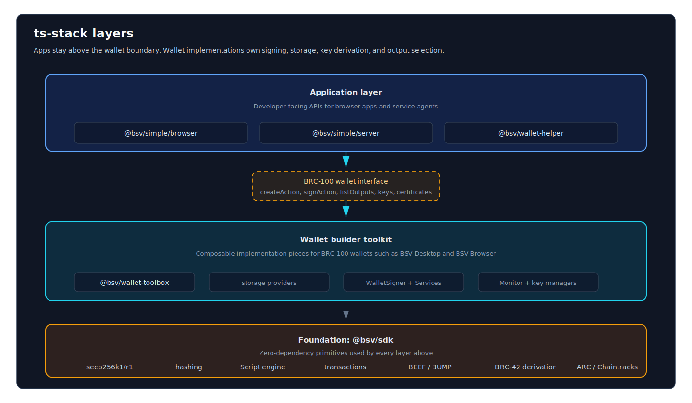

# Stack Layers

The stack is organized in three primary layers with supporting components that connect horizontally.

## Adjacent Capabilities

These packages are not a fourth vertical layer. They sit alongside the main stack and usually connect through the BRC-100 wallet interface, `@bsv/sdk` primitives, or direct service APIs.

| Capability | Packages | What it provides | Connects through |
|------------|----------|------------------|------------------|
| Data overlays | @bsv/overlay, @bsv/overlay-express, @bsv/overlay-topics | Topic managers, lookup services, SHIP/SLAP discovery, and shared on-chain context | `@bsv/sdk` transactions, overlay services |
| P2P messaging and payments | @bsv/message-box-client, @bsv/authsocket, @bsv/paymail | Store-and-forward encrypted messages, live authenticated channels, BRC-29 payment derivation | BRC-100 wallet, BRC-103/104 auth |
| Identity | @bsv/auth-express-middleware, @bsv/authsocket | BRC-31 HTTP handshake and peer identity framework | BRC-100 wallet, BRC-103/104 peer framework |
| Monetization | @bsv/402-pay, @bsv/payment-express-middleware | HTTP 402 payment-gated APIs and micropayment middleware | BRC-100 wallet, BRC-121 HTTP 402 |
| Tokens | @bsv/btms, @bsv/btms-permission-module | Token metadata, wallet permission display context, and BRC-48 PushDrop flows | BRC-100 wallet, overlay topics |
| Storage | @bsv/overlay-topics, UHRP | Universal Hash Resolution for content-addressed files | UHRP servers, BRC-26 |

## Foundation: @bsv/sdk

`@bsv/sdk` is the only zero-dependency package in the stack. It provides every primitive the other layers build on:

- **Cryptography** — secp256k1 and secp256r1 ECDSA, Schnorr, ECDH; SHA-256/512, RIPEMD-160, HMAC
- **Script engine** — Full Bitcoin Script interpreter and template system
- **Transactions** — Transaction builder, serialization, fee model, UTXO handling
- **BEEF** — `Beef` class: BRC-62 encoding/decoding, streaming validation ordering
- **Merkle paths** — `MerklePath` class: BRC-74 BUMP format, compound path support
- **Key derivation** — BRC-42 BKDS, BRC-43 security levels
- **Network** — `ArcBroadcaster` for transaction submission; `ChaintracksClient` for block headers
- **BRC-100 types** — Interface definitions consumed by wallet-toolbox and wallet clients

No dependencies means no `node_modules` vulnerabilities in the cryptographic core.

## BRC-100 Boundary

The BRC-100 wallet interface is the single most important seam in the stack. It separates:

- **Above** — Application business logic. Uses `createAction`, `signAction`, `listOutputs`, `listActions`, `internalizeAction`, and cryptographic primitives. Does not manage keys or storage.
- **Below** — Wallet/key management. Implements storage, signing, key derivation, UTXO selection, Merkle proof acquisition. Does not know what the application is building.

Any BRC-100-compliant wallet can be swapped below this boundary without changing application code.

## Wallet Builder Toolkit: @bsv/wallet-toolbox

`@bsv/wallet-toolbox` is not a single monolithic wallet. It is a set of composable modules:

| Module | Role |
|--------|------|
| `WalletStorageManager` | Orchestrates persistence providers (active + backup + incremental sync) |
| `KnexWalletStorage` | SQL persistence (SQLite, MySQL, PostgreSQL) |
| `IndexedDBWalletStorage` | Browser persistence |
| `RemoteWalletStorage` | Remote storage over HTTPS (for relay setups) |
| `Monitor` | Background daemon: confirms transactions, acquires Merkle proofs, rebroadcasts stalled txs |
| `PrivilegedKeyManager` | Handles the privileged-mode keyring for identity operations |
| `ShamirWalletManager` | Shamir secret sharing for key backup |
| `WalletSigner` | Bridges BRC-100 `signAction` to `@bsv/sdk` signing internals |
| `Services` | Container wiring ARC, Chaintracks, WhatsOnChain |

Wallet builders compose these into a BRC-100 `Wallet`. The resulting object is the same interface that `@bsv/simple` and other app-layer packages use.

## Application Layer: @bsv/simple

`@bsv/simple` is the recommended entry point for most application developers. `@bsv/simple/browser` returns a high-level browser wallet that wraps the SDK `WalletClient`; advanced callers can access the raw BRC-100 client with `wallet.getClient()`. Within a browser app, that client discovers an available wallet over localhost, postMessage, JSON API, or another supported substrate and exposes methods such as `createAction` and `listOutputs` without the app ever holding private keys. <!-- audio: ts-stack.m4a @ 00:00 -->

`@bsv/wallet-toolbox` is for developers building wallets, not applications. If you have a strong opinion about wallet UX or are building a competing wallet implementation, `wallet-toolbox` is where you start. <!-- audio: ts-stack.m4a @ 00:00 -->

Two entry points in `@bsv/simple`:

**`@bsv/simple/browser`** — Browser entry point. Communicates with the user's BRC-100 wallet over localhost, postMessage, or another SDK wallet substrate. The app never holds private keys. Exports include `createWallet`, `Wallet`, `Overlay`, `Certifier`, `DID`, `CredentialSchema`, `CredentialIssuer`, and `MemoryRevocationStore`.

**`@bsv/simple/server`** — Manages a self-custodial server wallet from a private key, using a wallet storage endpoint such as Wallet Infra. Suitable for automated agents, backend services, and MCP servers. Exports include `ServerWallet`, `ServerWalletManager`, `FileRevocationStore`, handler factories, `JsonFileStore`, `IdentityRegistry`, and `DIDResolverService`.

## Direct service access

Application code can also communicate with overlays, message box servers, and UHRP storage servers **independently of the wallet**. The wallet is only required for operations that need private keys. Private keys stay on the user's device at all times; the wallet interface is the architectural boundary separating key material from application code. <!-- audio: ts-stack.m4a @ 34:30 -->

## Related

- [Key Concepts](../get-started/concepts.md) — Terminology and protocol concepts
- [BEEF (BRC-62)](./beef.md) — Transaction format details
- [BRC-100 Interface](./brc-100.md) — Full method surface, labels/tags, batching
- [Conformance Pipeline](./conformance.md) — How the TS stack drives cross-language compatibility
