# Wallet UTXO Lifecycle

[BRC-100](../specs/brc-100-wallet.md) defines _what_ a wallet method accepts and returns.
This page covers the other half: what actually happens between the call and the return —
which layer does the work, which storage rows change, and what state a transaction and its
outputs are left in.

It is written against two implementations, [`@bsv/wallet-toolbox`](../packages/wallet/wallet-toolbox.md)
(TypeScript) and [`go-wallet-toolbox`](https://github.com/bsv-blockchain/go-wallet-toolbox)
(Go). The BRC-100 specification is the reference; both implementations are described
against it, and the places where either one deviates are collected in
[Implementation differences](#implementation-differences).

## How to read the diagrams

Each lane is a layer, and time runs downward. The lanes below appear in every diagram on
this page in the same order.

| Lane     | TypeScript                                                | Go                                                          |
| -------- | --------------------------------------------------------- | ----------------------------------------------------------- |
| App      | `packages/sdk/src/wallet/substrates/`                     | caller                                                      |
| Wallet   | `wallet-toolbox/src/Wallet.ts`                            | `pkg/wallet/wallet.go`                                      |
| Signer   | `src/signer/methods/`                                     | `pkg/wallet/internal/actions/`                              |
| Manager  | `src/storage/WalletStorageManager.ts`                     | `pkg/storage/storage_manager.go`                            |
| Storage  | `src/storage/StorageProvider.ts` + `src/storage/methods/` | `pkg/storage/provider.go` + `pkg/storage/internal/actions/` |
| Database | `StorageKnex` / `StorageIdb` / `StorageClient`            | `pkg/internal/storage/repo` over GORM                       |
| Services | `WalletServices` — broadcast, chaintracker, status        | `pkg/services`                                              |
| Monitor  | `src/monitor/tasks/`                                      | `pkg/monitor`                                               |

Two decorator layers sit between App and Wallet in TypeScript and are omitted from the
diagrams to keep them readable: `WalletPermissionsManager` (permission gating) and
`CWIStyleWalletManager` / `SimpleWalletManager` (authentication and key management). They
forward every BRC-100 method without changing its storage behavior.

Methods are ordered throughout this page by their wire call number from
`packages/sdk/src/wallet/substrates/WalletWireCalls.ts` — `createAction` is 1 and
`getVersion` is 28.

## The action lifecycle

A transaction that the wallet creates passes through up to four BRC-100 calls and a
background settling phase. `createAction` funds and records it; `signAction` completes it
when the application supplies unlocking scripts; broadcast hands it to the network; and
the Monitor converges its status on chain reality long after the original call returned.

### createAction — funding and planning

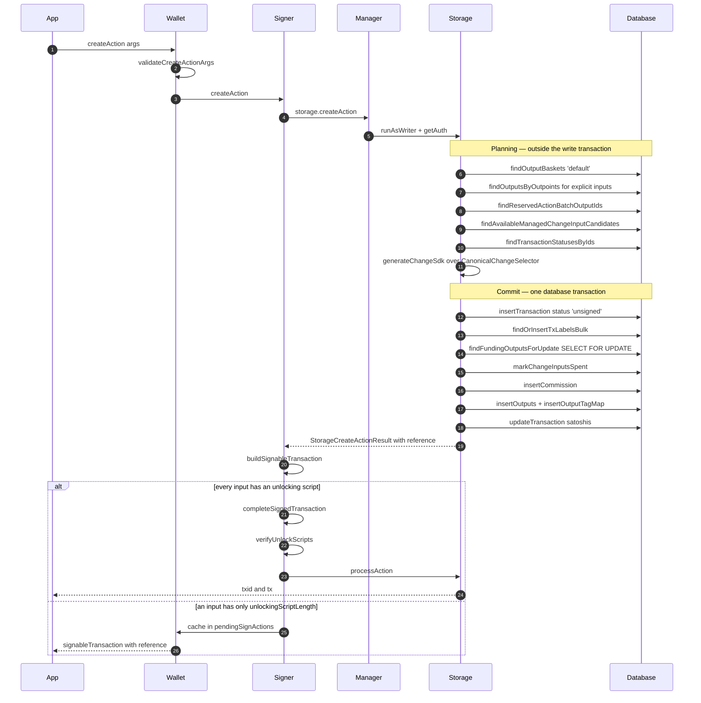

The write transaction opens at `storage/methods/createAction.ts:196` and every call from
`insertTransaction` onward is inside it. The transaction row is born `unsigned`
(`createAction.ts:690`). If anything downstream throws, the cleanup path drives it to
`failed` (`:309`) and records a forensic row (`:312`) rather than deleting evidence.

`markChangeInputsSpent` (`:1398`) is the moment funding becomes exclusive: it flips the
selected change outputs to `{spendable: false, spentBy: transactionId}` under the row
locks taken by `findFundingOutputsForUpdate` (`:1376`).

### Storage call ledger

Every storage-interface call each BRC-100 UTXO method makes, in execution order.

| Method              | Storage calls                                                                                                                                                                                                                                                                                                                                                                                                                                                                                                                                                                                  |
| ------------------- | ---------------------------------------------------------------------------------------------------------------------------------------------------------------------------------------------------------------------------------------------------------------------------------------------------------------------------------------------------------------------------------------------------------------------------------------------------------------------------------------------------------------------------------------------------------------------------------------------- |
| `createAction`      | `findOutputBaskets` · `findOutputsByOutpoints` / `…ForUpdate` · `findReservedActionBatchOutputIds` · `findAvailableManagedChangeInputCandidates` · `findTransactionStatusesByIds` · `getBeefForTransactions` · **transaction opens** · `insertTransaction` · `findOrInsertTxLabelsBulk` · `findOrInsertTxLabelMap` · `findFundingOutputsForUpdate` · `markChangeInputsSpent` · `validateOutputScript` · `getRawTxOfKnownValidTransaction` · `updateTransaction` · `findOrInsertOutputBasketsBulk` · `findOrInsertOutputTagsBulk` · `insertCommission` · `insertOutputs` · `insertOutputTagMap` |
| `signAction`        | none directly — the only storage touch is `processAction`                                                                                                                                                                                                                                                                                                                                                                                                                                                                                                                                      |
| `processAction`     | `findTransactions` · `findOutputs` · `findCommissions` · **transaction opens** · `ProvenTxReq.insertOrMerge` · `updateOutput` per output · `updateTransaction` · then `updateProvenTxReq` + `updateTransaction` (delayed) or `attemptToPostReqsToNetwork` (immediate)                                                                                                                                                                                                                                                                                                                          |
| `abortAction`       | `findAbortableTransaction` · `checkAbortChainProtection` · `updateTransactionStatus 'failed'` · ProvenTxReq → `invalid`                                                                                                                                                                                                                                                                                                                                                                                                                                                                        |
| `internalizeAction` | `findTransactions` · `findOutputs` · `findOutputBaskets` · `findOrInsertOutputBasket` · `findOrInsertProvenTx` · `findOrInsertTransaction` · `updateOutput` (mark inputs spent / restore) · `insertOutput` · `updateTransaction` · `findOrInsertTxLabel` · `shareReqsWithWorld`                                                                                                                                                                                                                                                                                                                |
| `listActions`       | `listActions` — read-only, `runAsReader`                                                                                                                                                                                                                                                                                                                                                                                                                                                                                                                                                       |
| `listOutputs`       | `listOutputs` — read-only, `runAsReader`                                                                                                                                                                                                                                                                                                                                                                                                                                                                                                                                                       |
| `relinquishOutput`  | `findOutputs` · `updateOutput` clearing `basketId`                                                                                                                                                                                                                                                                                                                                                                                                                                                                                                                                             |

`allocateChangeInput` is still declared on `StorageProvider` and implemented in both
`StorageKnex` and `StorageIdb`, but the current `createAction` path does not call it.
Coin selection runs in memory through `CanonicalChangeSelector` and is committed by
`markChangeInputsSpent`. Treat `allocateChangeInput` as legacy surface, not as part of
this flow.

### signAction — completing a signable transaction

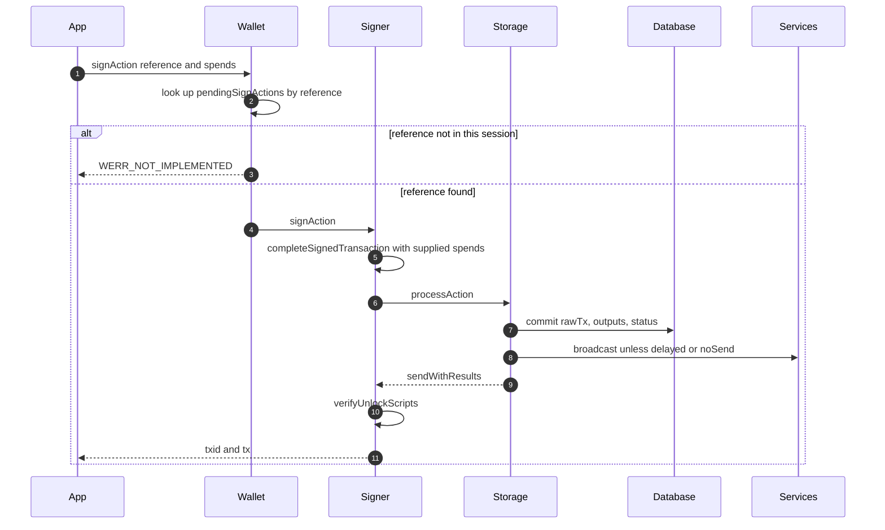

The `pendingSignActions` cache is process memory on the `Wallet` instance. A `reference`
issued by one process cannot be signed by another, and cannot survive a restart —
`Wallet.ts:1056` throws `WERR_NOT_IMPLEMENTED` rather than attempting recovery. Go stores
these in a pluggable repository instead; see [difference 6](#implementation-differences).

### processAction — commit and broadcast

`processAction` is the shared tail of both `createAction` and `signAction`. It validates
the signed transaction against what storage planned, commits it, and then either
broadcasts or queues.

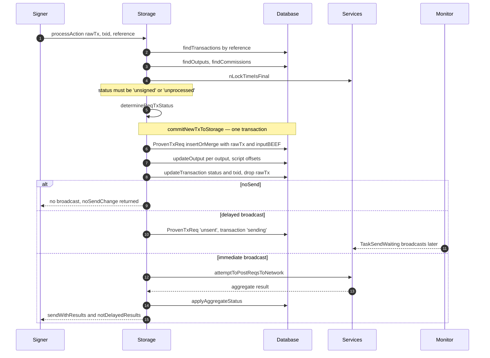

Which statuses a new transaction gets is decided entirely by the three options
`noSend`, `sendWith`, and `acceptDelayedBroadcast`:

| Case                       | ProvenTxReq before | Transaction before | ProvenTxReq after send | Transaction after send |
| -------------------------- | ------------------ | ------------------ | ---------------------- | ---------------------- |
| `noSend` and no `sendWith` | `nosend`           | `nosend`           | —                      | —                      |
| not `noSend`, delayed      | `unsent`           | `unprocessed`      | —                      | —                      |
| not `noSend`, immediate    | `unprocessed`      | `unprocessed`      | `unmined`              | `unproven`             |

Only the third row broadcasts before `createAction` returns. The first two leave the
transaction for the Monitor or for a later `sendWith` batch.

When a broadcast does happen, its outcome maps to statuses like this:

| Aggregate broadcast result     | ProvenTxReq   | Transaction |
| ------------------------------ | ------------- | ----------- |
| success                        | `unmined`     | `unproven`  |
| double spend                   | `doubleSpend` | `failed`    |
| invalid transaction            | `invalid`     | `failed`    |
| service error, attempt counted | `sending`     | `sending`   |

A guard prevents degradation: a request already `completed` or `unmined` is never moved
backward by a late result.

## Transaction status

Two rows track every transaction. `transactions.status` is what `listActions` reports to
the application. `proven_tx_reqs.status` is the broadcast and proof state machine that the
Monitor drives. They advance together but are not the same set of values.

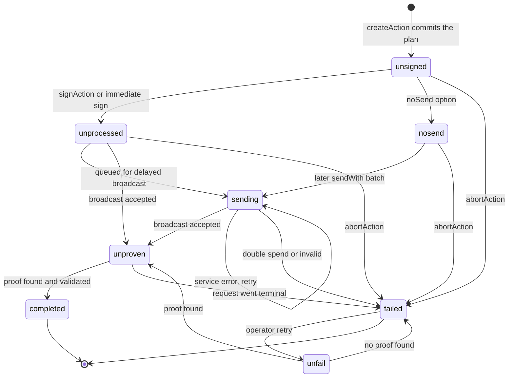

The proof-request machine underneath it:

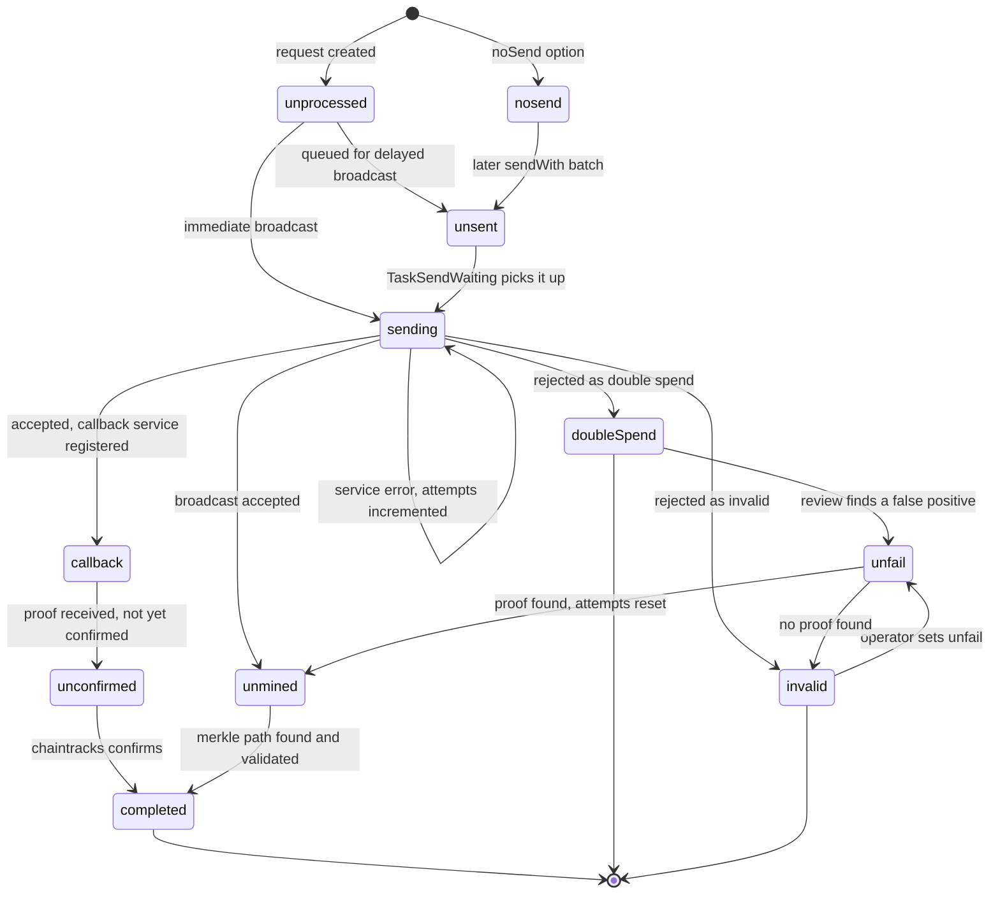

Terminal states are `completed`, `invalid`, and `doubleSpend`. Everything else is
non-terminal and eligible for Monitor attention.

### The transition primitive

`StorageProvider.updateTransactionStatus` is where transaction status and output
spendability are coupled. It enforces two invariants and one cascade:

- A `completed` transaction, or one with a `provenTxId`, cannot change status.
- A `failed` transaction cannot be un-failed by this method.
- Moving to `failed` runs `releaseInputsAllocatedToFailedTransaction` — every output this
  transaction consumed goes back to `{spendable: true, spentBy: undefined}` — and
  `markFailedTransactionOutputsNotSpendable`, which makes the outputs it produced
  unspendable.

Restoring inputs optimistically is deliberate: most failures are transient. When a
broadcaster reports evidence that an input really is gone — a double-spend or
missing-inputs verdict with positive `isUtxo === false` confirmation —
`recordStaleInputEvidence` overrides the restore for exactly those inputs, so the wallet
does not select the same dead UTXO on the next `createAction`. Inputs whose failure was
malformed-transaction or fee-related are left spendable and retry normally.

## Outputs and UTXO state

There is no output status column. An output's state is a tuple: `spendable`, `spentBy`,
`basketId`, and the status of its parent transaction.

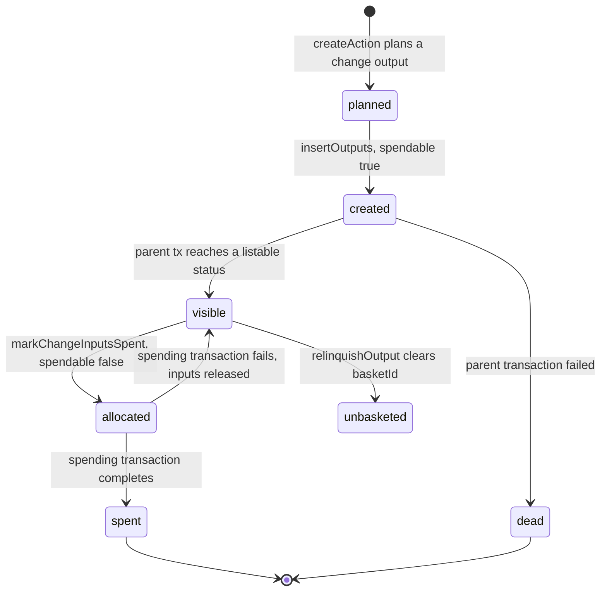

`listOutputs` does not read `spendable` alone. Visibility is a join: the parent
transaction status must be one of `completed`, `unproven`, `nosend`, or `sending`, **and**
`spendable` must be true. An output belonging to an `unsigned` or `failed` transaction is
invisible regardless of its own column.

`relinquishOutput` clears `basketId` and nothing else. It removes the output from the
basket index; it does not make it unspendable and does not mark it spent. BRC-100
describes it as removing an output from a basket without spending it, which is what this
implements — but note that an unbasketed output is no longer returned by any
`listOutputs` call, since `basket` is a required argument.

### Funding and coin selection

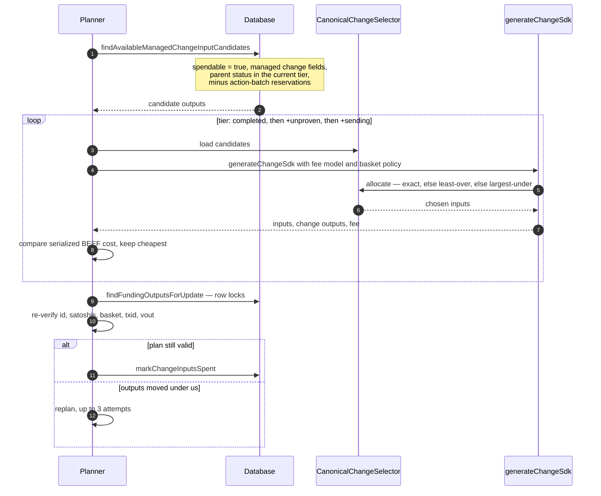

Selection order is exact match, then smallest sufficient, then largest insufficient, with
`outputId` breaking ties. Change is shaped by the basket's own policy — target UTXO count
and minimum desired value — and any change slice below the dust floor is donated to the
fee rather than created. The dust floor is twice the fee of spending a minimal P2PKH
input, on the principle that an output not worth its own spend cost should never exist.

Planning happens before the write transaction opens and the claim happens inside it, so a
concurrent `createAction` that takes the same outputs first causes a re-plan rather than a
lock wait. Three failed claims in a row raise `WERR_INVALID_OPERATION` telling the caller
to retry.

## Importing and cancelling

### internalizeAction

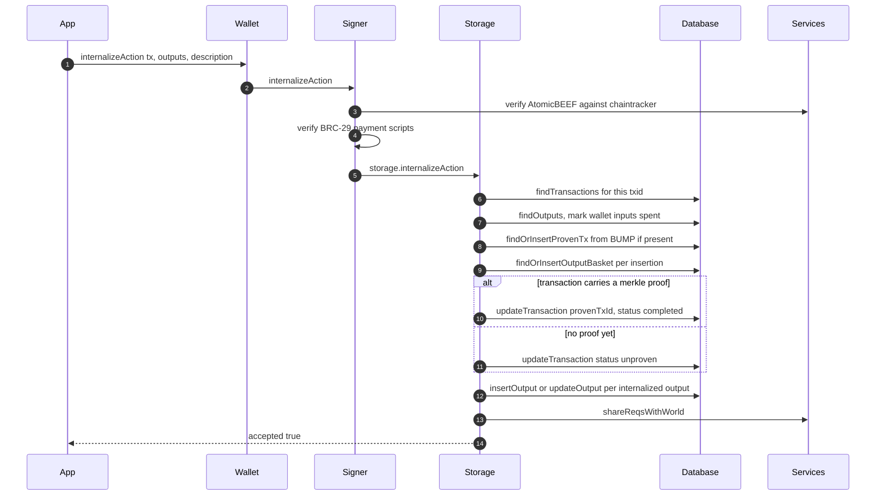

`internalizeAction` is the only BRC-100 method that adds spendable outputs without
`createAction` having planned them. Two protocols are supported: `wallet payment`, which
uses the BRC-29 derivation prefix and suffix to prove the output belongs to this wallet,
and `basket insertion`, which files an arbitrary output into a named basket with
custom instructions and tags.

### abortAction

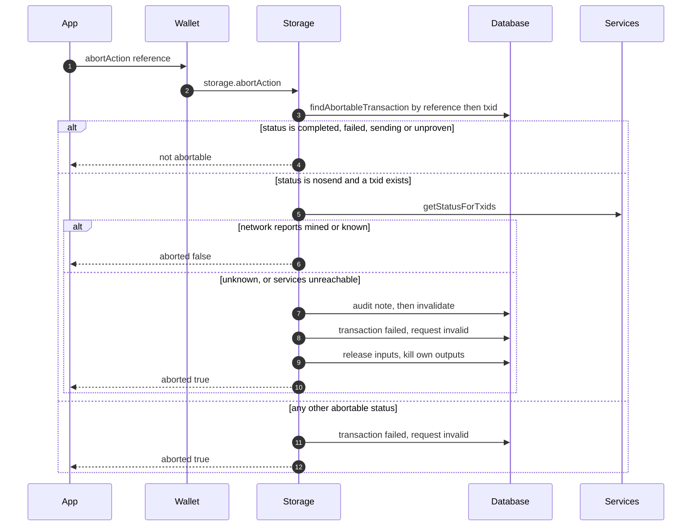

The chain-status check exists because a `noSend` transaction can be broadcast by the
application itself. Aborting it after it has propagated would orphan every output it
created, including the wallet's own change. Refusal requires positive confirmation; if the
service is unreachable the abort proceeds and writes an audit note, because BRC-100
callers must retain the ability to abort offline.

## Settling — the Monitor

Everything above returns long before a transaction is final. The Monitor is the lane that
moves `unproven` to `completed`, retries what the network dropped, and repairs state that
drifted.

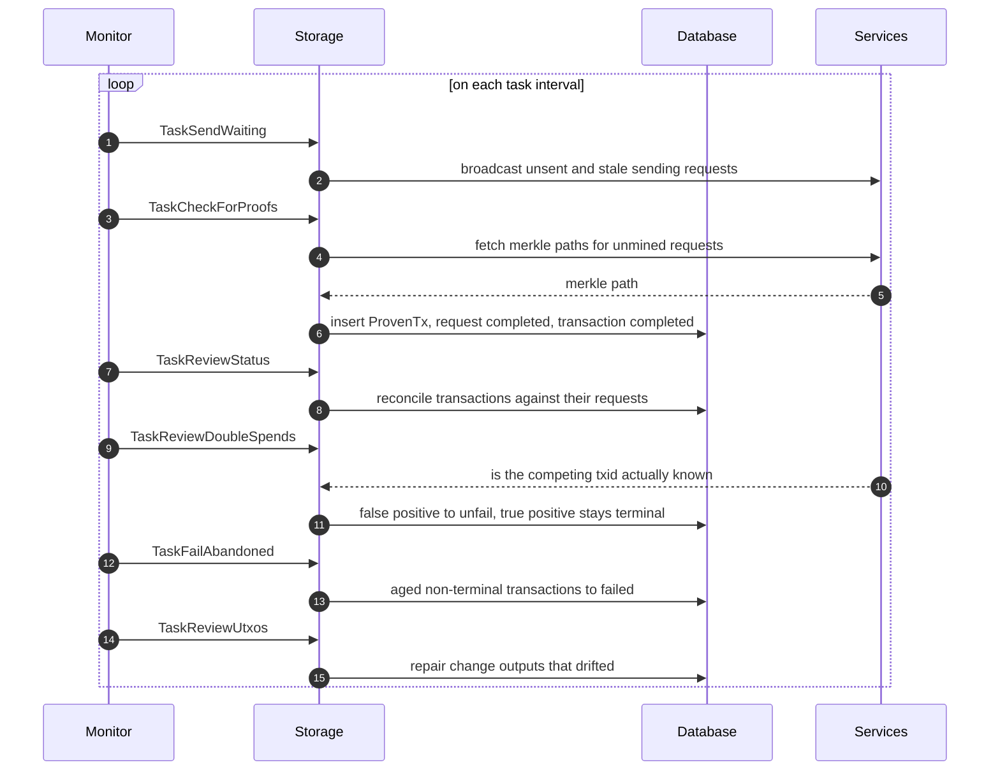

Nineteen tasks ship in `src/monitor/tasks/`. Beyond those above, `TaskReorg` and
`TaskNewHeader` handle chain reorganisation, `TaskCheckNoSends` settles `nosend`
transactions, `TaskUnFail` retries operator-flagged failures, `TaskArcSSE` consumes
broadcaster push events, `TaskPurge` and `TaskCleanupActionBatches` reclaim storage, and
`TaskSyncWhenIdle` replicates to backup stores.

## The Go implementation

Go follows the same overall shape — wallet, signer, manager, provider, database — but
differs in three mechanisms that materially change UTXO behavior.

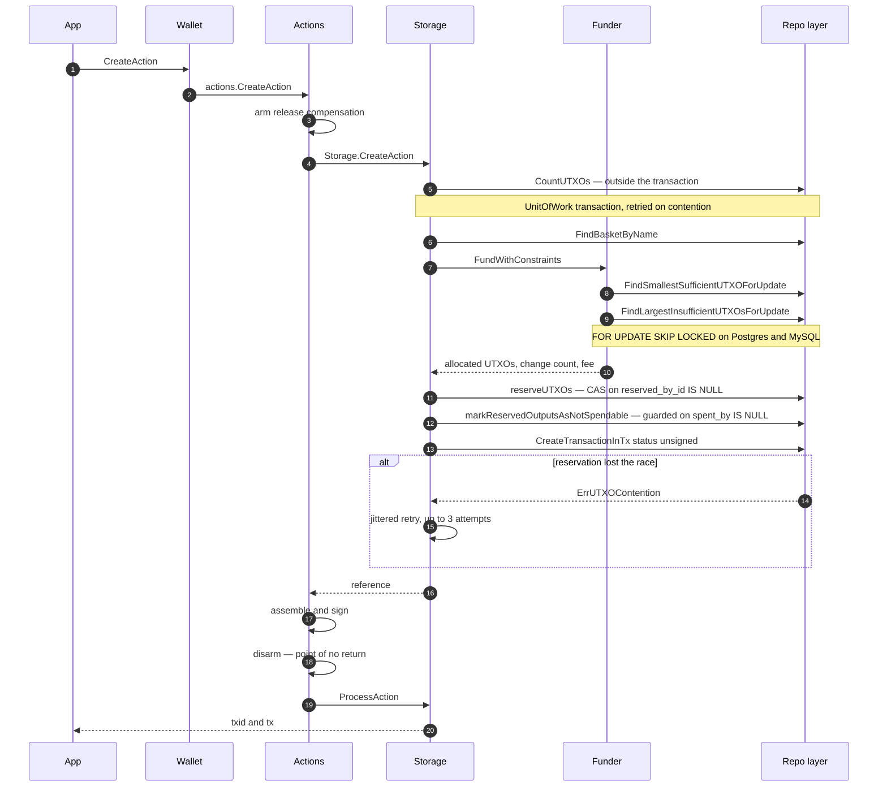

**Reservation is two-layered.** A dedicated `bsv_user_utxos` index carries
`reserved_by_id`, and `bsv_outputs` carries `spendable` and `spent_by`. `reserveUTXOs`
performs a compare-and-set on `reserved_by_id IS NULL` and treats a row-count mismatch as
`ErrUTXOContention`; `markReservedOutputsAsNotSpendable` separately guards on
`spent_by IS NULL` and raises a stale-index or provided-input conflict. Both run inside
one database transaction but fail for different reasons, and only the first is retried.

**Compensation is explicit.** `CreateAction` arms a release before touching storage and
disarms it once signing succeeds. If anything fails in between, the release calls
`AbortAction` on a detached context with a ten-second timeout. TypeScript has no
equivalent lane; it relies on the database transaction and the `failed` status cascade.

**Change becomes claimable at two different moments.** On the delayed path, change is
promoted at queue time. On the immediate path it is promoted only when the network accepts
the transaction. TypeScript sets `spendable: true` at commit and gates visibility through
the parent-status join instead.

Four scheduled Monitor tasks are registered in Go — check for proofs, send waiting, fail
abandoned, and unfail — alongside event-driven consumers for broadcast status, reorgs, and
new tips. See [difference 11](#11-background-convergence-uses-different-mechanisms).

## BRC-100 method inventory

Every method in the interface, in wire-call order, with where it lands.

### Actions and outputs

| #   | Method              | Storage reached     | Writes                                                       |
| --- | ------------------- | ------------------- | ------------------------------------------------------------ |
| 1   | `createAction`      | yes                 | transaction, outputs, baskets, tags, labels, commission      |
| 2   | `signAction`        | via `processAction` | request, outputs, transaction status                         |
| 3   | `abortAction`       | yes                 | transaction `failed`, request `invalid`, output spendability |
| 4   | `listActions`       | read only           | —                                                            |
| 5   | `internalizeAction` | yes                 | transaction, outputs, baskets, proven transaction            |
| 6   | `listOutputs`       | read only           | —                                                            |
| 7   | `relinquishOutput`  | yes                 | output `basketId` cleared                                    |

### Keys and cryptography

Methods 8 through 16 — `getPublicKey`, `revealCounterpartyKeyLinkage`,
`revealSpecificKeyLinkage`, `encrypt`, `decrypt`, `createHmac`, `verifyHmac`,
`createSignature`, `verifySignature` — reach the key deriver and never touch storage.

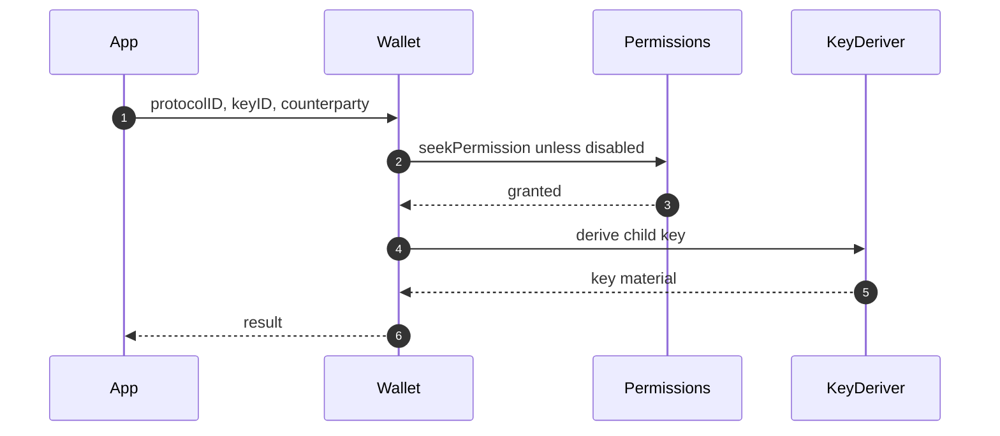

`privileged: true` routes derivation through the privileged key manager, which may prompt
the user with `privilegedReason`.

### Certificates and identity

Methods 17 through 22 — `acquireCertificate`, `listCertificates`, `proveCertificate`,
`relinquishCertificate`, `discoverByIdentityKey`, `discoverByAttributes`.

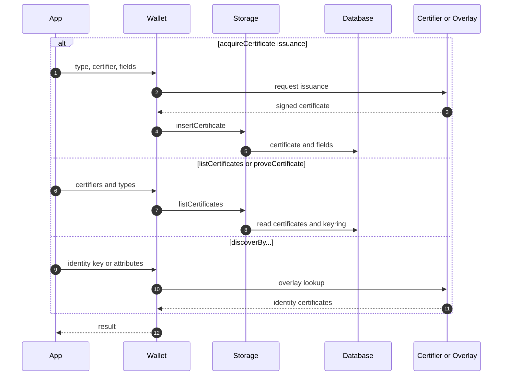

`relinquishCertificate` deletes the certificate row. The discovery methods query overlay
services and do not persist.

### Wallet state

Methods 23 through 28 — `isAuthenticated`, `waitForAuthentication`, `getHeight`,
`getHeaderForHeight`, `getNetwork`, `getVersion`. The first two are answered by the
authentication manager; `getHeight` and `getHeaderForHeight` query chain services;
`getNetwork` and `getVersion` are constants. None touch storage.

### Methods beyond the specification

Both implementations expose helpers outside BRC-100. They are useful, and they are not
portable — an application that calls them is no longer wallet-agnostic.

| TypeScript                                                                                                                           | Go                                                                               |
| ------------------------------------------------------------------------------------------------------------------------------------ | -------------------------------------------------------------------------------- |
| `sweepTo`, `balanceAndUtxos`, `balance`, `reviewSpendableOutputs`, `setWalletChangeParams`, `listNoSendActions`, `listFailedActions` | `FanOutFuel`, `ListFailedActions`, `ListTransactions`, `Balance`, `GetBeefParty` |

## Implementation differences

Each entry states what BRC-100 requires, then how each implementation behaves. Where the
specification is silent, that is said rather than assumed.

### 1. Failed transactions treat spent inputs oppositely

BRC-100 does not specify what happens to inputs of a transaction that fails to broadcast.

TypeScript releases them. `updateTransactionStatus('failed')` restores every consumed
output to `{spendable: true, spentBy: undefined}`, and then `recordStaleInputEvidence`
selectively re-marks only those inputs the chain positively confirms are gone.

Go never releases them. The broadcast handler marks created outputs unspendable and
leaves inputs spent, with the reasoning recorded in the code: a missing-inputs or
double-spend verdict can be a false positive, and re-spending an input that is still valid
risks a real double spend. Only `AbortAction` and the abandoned-transaction sweep restore
inputs.

Both are defensible. They produce different balances after the same failure, which is why
this is the most consequential difference on the list.

### 2. Change becomes spendable at different times

BRC-100 does not specify when change from an in-flight transaction becomes visible to
`listOutputs`.

TypeScript marks change `spendable: true` at commit and gates visibility on the parent
transaction's status. Go promotes change at queue time on the delayed path and at network
acceptance on the immediate path. The same wallet state can therefore yield different
`listOutputs` results across implementations while a transaction is in flight.

### 3. `getNetwork` returns non-specification values in Go

BRC-100 requires `'mainnet'` or `'testnet'`. The Go SDK returns `main` and `test`, the
values stored internally and in the database. The Go conformance suite documents this and
configures its vectors around it. TypeScript returns the specified values.

### 4. Protocol name minimum length is unspecified and diverges

BRC-100 does not state a minimum length for the protocol string in a `WalletProtocol`
tuple. The Go SDK enforces five characters; TypeScript does not. Fifty-one `getPublicKey`
conformance vectors using the three-character name `app` are skipped on the Go side. This
is a specification gap before it is an implementation gap.

### 5. Remote storage client returns empty results instead of failing

TypeScript's `StorageClientBase` implements the full storage surface over HTTP.

Go's V1 client leaves four methods unimplemented, and two of them fail silently:
`findOutputBasketsAuth` and `findOutputsAuth` return empty collections with a nil error,
which a caller cannot distinguish from a genuine empty result. `SetActive` and
`ProcessSyncChunk` at least return errors.

### 6. Signable-transaction references do not survive the session in TypeScript

BRC-100 does not bound the lifetime of a `signableTransaction` reference.

TypeScript holds pending sign actions in process memory and throws
`WERR_NOT_IMPLEMENTED` for any reference it does not recognise, so a reference cannot
cross a process boundary or a restart. Go supports a pluggable pending-sign-actions
repository and can persist them. Go is ahead here.

### 7. Status vocabularies differ

The proof-request terminal failure state is `invalid` in TypeScript and `invalidTx` in
Go. Go additionally defines `reorg`, which TypeScript handles through a Monitor task
rather than a status value.

Go also defines a tenth transaction status, `aborted`, distinguishing a retryable abort
from a permanent failure. TypeScript folds both into `failed`. The Go design record for
this status already documents it as Go-only, with TypeScript parity deferred, and
describes it as a known BRC-100 wire-parity ceiling.

### 8. Abort protection uses different evidence

BRC-100 says `abortAction` cancels an action before it is finalized, without defining
finalized.

TypeScript asks the network whether the transaction is already mined or known, and refuses
on positive confirmation. Go requires proof the transaction never reached a broadcaster —
never-posted status, no broadcast flag, zero attempts — and refuses otherwise. TypeScript
proceeds when services are unreachable and writes an audit note; Go's guard is local and
does not depend on network reachability.

Both prevent the same failure mode. Go's is stricter and cannot be defeated by a network
outage; TypeScript's preserves the ability to abort offline.

### 9. Action batching exists only in TypeScript

The TypeScript storage interface carries `getCapabilities` plus seven batch methods and a
whole output-reservation surface, letting a client plan many actions against reserved
outputs and commit them together. The Go storage interface has none of it. This is
additive on the TypeScript side and does not affect BRC-100 conformance.

### 10. Storage interface surface differs in both directions

Go adds `ListTransactions` and `GetBalance` to the storage provider interface; TypeScript
has neither there and answers the equivalent questions through `listActions` and
list-outputs special operations.

### 11. Background convergence uses different mechanisms

TypeScript ships nineteen registered Monitor tasks; Go registers four. That comparison is
misleading on its own, because Go moves much of the same work off the scheduler:

- **Event consumers.** `pkg/monitor` runs an SSE broadcast-event pipeline with a persisted
  replay cursor (`arcade_sse_last_event_id`) plus reorg and new-tip consumers. Reorg
  handling is real — `Provider.HandleReorg` invalidates merkle proofs for orphaned blocks —
  it is simply event-driven rather than polled.
- **Inline verification.** `confirmDoubleSpends` re-verifies every aggregated double-spend
  verdict before it becomes terminal, downgrading false positives to `serviceError` for
  retry. TypeScript does the equivalent in a scheduled `TaskReviewDoubleSpends`.

What TypeScript has and Go does not reproduce is the `reviewStatus` cascade, which
reconciles transaction rows against their proof requests. Statuses that only that cascade
advances will not advance in Go. Purge and action-batch cleanup also have no Go
counterpart, the latter because Go has no action batching at all.

### 12. Conformance vectors are vendored and stale in Go

`go-wallet-toolbox` vendors ten of the twenty-seven BRC-100 vector files, pinned to a
ts-stack commit fetched in May 2026. Seventeen method vector files are not exercised
against the Go implementation at all.

### 13. Known open gaps tracked on the Go side

Recorded in `go-wallet-toolbox/plans/` and reproduced here so the matrix is complete:
`internalizeAction` broadcasts in band in TypeScript but only queues in Go;
`WERR_REVIEW_ACTIONS` does not carry `txid`, `tx`, `sendWithResults`,
`reviewActionResults`, or `noSendChange` in Go, and `signAction` `noSendChange` remains
incomplete; `listOutputs` lacks `includeLabels`; `knownTxids` handling, BRC-114 time
labels in `listActions`, the `inputBEEF` JSON array wire format, and the certificate
type and serial wire format all have open parity work.

### 14. Documentation drift

`go-wallet-toolbox/docs/wallet.md` stated that the certificate APIs were placeholders.
They are implemented — acquisition by both issuance and direct receipt, listing, proving,
relinquishing, and both discovery methods. That note is corrected in the companion page.

## Related

- [BRC-100 Wallet Interface](../specs/brc-100-wallet.md) — method reference
- [BRC-100 architecture](./brc-100.md) — why the boundary exists
- [Storage adapter](../specs/storage-adapter.md) — the storage layer contract
- [BRC-29 peer payment](../specs/brc-29-peer-payment.md) — the derivation scheme every managed change output uses
- [@bsv/wallet-toolbox](../packages/wallet/wallet-toolbox.md)
- [Conformance](../conformance/index.md)
