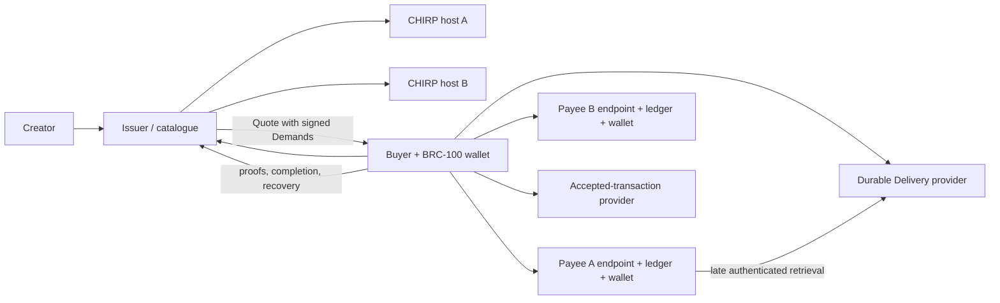

# Build Production CHIRP and LCH Applications

> Publish large verified ciphertext with CHIRP, describe and license it with
> LCH, pay every rights controller directly, and recover safely when a service
> becomes unavailable after transaction creation.

**Time:** ~45 minutes

**Prerequisites:** TypeScript, a BRC-100 wallet, one or more CHIRP-capable UHRP
hosts, and HTTPS endpoints for the LCH roles you operate.

The normative standards are [BRC-167 CHIRP](https://bsv.brc.dev/overlays/0167)
and [BRC-170 LCH](https://bsv.brc.dev/apps/0170). This guide explains the TS
Stack reference implementation and a production architecture. The standards
remain authoritative where behavior differs.

## Choose The Layers

CHIRP and LCH are independent. Use either one alone or compose them.

| Need                                                                      | Use             | Result                                                                             |
| ------------------------------------------------------------------------- | --------------- | ---------------------------------------------------------------------------------- |
| Small, indivisible public bytes addressed by a digest                     | UHRP            | One `uhrp:` object                                                                 |
| Large or range-read bytes with progressive upload and resilient retrieval | CHIRP over UHRP | One `chirp:` root plus verified Merkle objects                                     |
| Encrypted content, portable rights, payment, key delivery, or composition | LCH             | One `.lch` header, embedded or detached ciphertext, and signed acquisition objects |
| Large licensed media                                                      | LCH + CHIRP     | An LCH representation whose encrypted ciphertext is stored at a `chirp:` locator   |

The important boundary is simple:

- CHIRP proves that retrieved bytes match a root and supports bounded,
  interleaved, range-aware access. It does not prove authorship, grant rights,
  or collect payment.
- LCH authenticates the Asset, encrypts its representation, expresses rights
  and usage, coordinates payment evidence, delivers keys, and records
  composition. It does not require a particular content host.
- UHRP discovery remains the way CHIRP finds complete hosts. Existing UHRP
  identifiers, upload/download APIs, advertisements, and routes are unchanged.

## Install

```bash
npm install @bsv/lch @bsv/chirp @bsv/sdk
```

Both packages support browsers and Node.js. A browser should use its wallet and
normal network boundary. A server should also configure DNS resolution,
connection address pinning, request limits, and credential scoping.

## Public API By Role

| Role                               | Primary APIs                                                                                                           |
| ---------------------------------- | ---------------------------------------------------------------------------------------------------------------------- |
| Canonical CHIRP construction       | `CHIRPBuilder`, byte-source adapters, codecs, and closure validation                                                   |
| Authenticated CHIRP publication    | `CHIRPUploader`, `CHIRPUploadCheckpoint`, and the `chirp publish` CLI                                                  |
| CHIRP retrieval                    | `CHIRPDownloader.stream()`, `download()`, object caches, and the `chirp retrieve/verify` CLI                           |
| LCH creator and issuer             | `LCHPublisher`, `LCHIssuer`, `LCHQuoteIssuer`, `WalletBRC77Signer`, and `WalletBRC78KeyDelivery`                       |
| LCH buyer and player               | `LCHReader`, `LCHMultipayBuyer`, `LCHHttpAcquisitionClient`, and `IndexedDBLicenseStore`                               |
| Independent Payee                  | `LCHPayee`, `WalletPaymentReceiver`, and a durable `PaymentLedger` implementation                                      |
| Authorized-output providers        | `WalletAuthorizedOutputPayee`, `LCHSettlementService`, and durable Authorization/Delivery stores                       |
| Wire transport                     | `LCHHttpServer` for Fetch-compatible handlers or an application `LCHAcquisitionTransport`                              |
| Policy, authority, and composition | `parsePinnedPolicy`, `validateAuthorityChain`, `LCHComposer`, `activeIngredients`, and `walkComposition`               |
| Storage bridge                     | `CHIRPContentSink`, `UHRPContentSink`, `UniversalContentSource`, or application `ContentSink`/`ContentSource` adapters |

Prefer the high-level classes for workflows and the exported validators at
trust boundaries. Signed objects remain portable; a server framework,
database, catalogue, wallet substrate, and media decoder are application
choices.

## Publish LCH Ciphertext Through CHIRP

`CHIRPContentSink` adapts a `CHIRPUploader` to LCH's storage boundary for the
simple path. CHIRP receives only ciphertext; plaintext and content-encryption
keys stay with the creator/issuer path.

```typescript
import { CHIRPUploader } from '@bsv/chirp'
import { CHIRPContentSink, LCHPublisher, WalletBRC77Signer } from '@bsv/lch'

const signer = await WalletBRC77Signer.create({ wallet: issuerWallet })
const chirpUploader = new CHIRPUploader({
  wallet: issuerWallet,
  storageURLs: ['https://storage-a.example', 'https://storage-b.example'],
  resilienceLevel: 2
})

const ciphertextSink = new CHIRPContentSink(chirpUploader, 2_592_000, 'application/octet-stream')

const publisher = new LCHPublisher(signer)
const protectedAsset = await publisher.protect(plaintext, {
  name: 'performance.wav',
  mediaType: 'audio/wav',
  segmentSize: 1_048_576,
  keyPeriodSegments: 16,
  rights: [
    {
      interest: 'sound-recording',
      holder: { name: 'Performer' },
      controller: signer.identityKey
    }
  ],
  sink: ciphertextSink
})
```

Create the signed Offer only after `protectedAsset.assetId` exists. Then publish
the detached LCH by passing `false` as the third `publish` argument. The Asset
Body commits to ciphertext length and digest as well as the `chirp:` locator,
so the LCH reader revalidates the complete resolved ciphertext independently of
CHIRP's object and root checks.

Choose the LCH encryption segment size for license and playback behavior, not
to imitate CHIRP chunks. BRC-170 recommends alignment where practical, but the
two formats retain independent identifiers and validation.

The built-in sink intentionally has a small interface. When publication must
survive restart, provide an application `ContentSink` that calls
`CHIRPUploader.publish()` with `resume` and an `onCheckpoint` callback, and
encrypt the checkpoint store because it contains host session capabilities:

```typescript
const resumableCiphertextSink = {
  async put(ciphertext: Uint8Array): Promise<string[]> {
    const result = await chirpUploader.publish({
      source: ciphertext,
      logicalLength: ciphertext.length,
      retentionSeconds: 2_592_000,
      mediaType: 'application/octet-stream',
      resume: await checkpointStore.get(uploadKey),
      onCheckpoint: checkpoint => checkpointStore.put(uploadKey, checkpoint)
    })
    await checkpointStore.delete(uploadKey)
    return [result.chirpURL]
  }
}
```

## Read A Detached LCH

`UniversalContentSource` dispatches `chirp:`, `uhrp:`, and bounded HTTPS
locators. The LCH reader validates the header signer, Asset ID, ciphertext
length and digest, authenticated encryption segments, and full-plaintext digest
when the complete selection is decrypted. A `uhrp:` read tries each unique
resolved host in order; every candidate remains subject to the same bounded
response and endpoint policy.

```typescript
import { CHIRPDownloader } from '@bsv/chirp'
import { IndexedDBLicenseStore, LCHReader, UniversalContentSource } from '@bsv/lch'

const source = new UniversalContentSource({
  chirp: new CHIRPDownloader({
    concurrency: 4,
    urlPolicy: chirpUrlPolicy
  }),
  maximumBytes: 512 * 1024 * 1024,
  endpointPolicy
})
const licenseStore = new IndexedDBLicenseStore()
const reader = new LCHReader(source, licenseStore)

const inspected = await reader.inspect(lchBytes)
// After validating and storing a License, unwrap its BRC-78 key grants.
const plaintext = await reader.decrypt(inspected, contentKeys, licensedSelection)
```

The current `LCHPublisher.protect()` and `LCHReader.resolve()/decrypt()`
reference path accepts bounded `Uint8Array` values and assembles the selected
representation in memory. Set `maximumBytes` to an application limit and use
this path only for assets that fit it. `CHIRPDownloader.stream()` supports
verified range delivery, but applications must not expose those ciphertext
ranges as LCH plaintext until a segment-aware streaming adapter authenticates
the complete LCH encryption records and licensed selection. That streaming LCH
adapter is not part of the 0.1 API.

`endpointPolicy` governs direct HTTPS locators and LCH role endpoints;
`CHIRPDownloader.urlPolicy` separately governs the hosts returned by UHRP
resolution. Server applications must constrain both. Supply
`authorizeHeaderSigner` to `LCHReader` only when an application permits a
delegated header signer in addition to the declared rights controllers.

Each released CHIRP blob is hash-verified, but a complete CHIRP stream can only
verify the root `contentHash` at termination. Buffer atomically when early
consumption is unsafe. Never pass unverified or unauthenticated bytes to a
decoder merely because the declared `mediaType` looks familiar.

## Acquisition Has One Irreversible Boundary

Inspecting an LCH, preflighting, and obtaining a Quote do not spend money.
`LCHMultipayBuyer.createPayment()` is the explicit transaction-creation
boundary. The buyer must show the signed terms, action, selection, total, split,
Payees, and settlement profiles before calling it.

```typescript
import { LCHMultipayBuyer, toHex, type AuthorizedOutputEvidence, type SignedObject } from '@bsv/lch'

const buyer = await LCHMultipayBuyer.create(buyerWallet, { endpointPolicy })
const request = await buyer.createRequest({
  offerId,
  assetId,
  action: 'play',
  selection: { type: 'all' },
  acceptedPolicyDigest,
  createdAt: BigInt(Math.floor(Date.now() / 1000))
})
const plan = await buyer.quote(acquisitionEndpoint, request, issuerIdentity, {
  type: 'segmented',
  encryption: inspected.representation.encryption,
  delivery: selectedOffer.keyDelivery.mechanism
})

// Display and confirm plan.totalSatoshis and every signed Demand here.
const freshPlan = await buyer.refreshReadiness(plan)
const funded = await buyer.createPayment(freshPlan)

// This durable write must finish before network fan-out.
await recoveryStore.put(funded)

const receipts: SignedObject[] = []
const authorizedOutputs: AuthorizedOutputEvidence[] = []
for (const delivery of funded.deliveries) {
  const proof = await buyer.settleDelivery(funded, delivery)
  await recoveryStore.addProof(funded.plan.requestId, proof)
  if (proof.type === 'receipt') receipts.push(proof.receipt)
  else authorizedOutputs.push(proof.evidence)
}

const license = await buyer.complete(funded, receipts, authorizedOutputs)
await licenseStore.put({
  assetId: toHex(assetId),
  offerId: toHex(offerId),
  license,
  storedAt: BigInt(Math.floor(Date.now() / 1000))
})
await recoveryStore.complete(funded.plan.requestId)
```

The required key-grant expectation comes from the already verified Asset and
selected Offer, not from the Quote. On completion the client rejects a signed
License with a different Asset, Offer, buyer, Selection, segment coverage,
settlement evidence, key-period set, or key-delivery mechanism. Persist this
expectation with the funded plan so recovery performs the same checks.
Authorized-output fallback begins only when the direct Payee transport rejects;
a syntactically returned Receipt that fails signature, Demand, transaction,
output-index, or amount validation is a protocol error and MUST NOT be routed
through fallback providers.

`createPayment()` returns finalized transaction bytes. **Finalized** means the
wallet produced a signed Atomic BEEF. It does not mean a processor accepted the
transaction, the network broadcast it, or a block mined it. Persist the exact
result and signed Deliveries before contacting any Payee or provider.

If delivery or completion times out, recover or resume using the same funded
transaction. Do not automatically create a replacement purchase: the first
transaction may already pay every output even though the response was lost.

## Where The Money Goes

Each signed Payment Demand names one Payee identity, amount, BRC-29 derivation
prefix, endpoint, and settlement profile. The buyer wallet creates one exact
output for each Demand. A `WalletPaymentReceiver` at that Payee's endpoint:

1. verifies the buyer's signed Delivery and the Demand binding;
2. derives and matches the exact BRC-29 locking script and amount;
3. atomically claims the Demand in a durable `PaymentLedger`;
4. invokes that Payee wallet's BRC-100 `internalizeAction`; and
5. returns the Payee's signed Receipt.

The issuer receives money only when an issued Demand explicitly names the
issuer as a Payee. A drummer, composer, label, publisher, or other controller
can each operate a separate identity, wallet, endpoint, ledger, and hosting
provider. The Quote coordinates their signed Demands; it does not make them
custodial subaccounts of the issuer.

## Choose A Settlement Profile

| Profile                | License can issue when                                                                                                                            | Best fit                                                      | Tradeoff                                                                                                  |
| ---------------------- | ------------------------------------------------------------------------------------------------------------------------------------------------- | ------------------------------------------------------------- | --------------------------------------------------------------------------------------------------------- |
| `receipt-complete-v1`  | Every Payee wallet has internalized its output and signed a Receipt                                                                               | Smallest trust boundary and strongest direct acknowledgement  | An offline Payee keeps the purchase pending                                                               |
| `authorized-output-v1` | Direct delivery succeeded, or the Payee's exact pre-authorization, accepted-transaction evidence, and durable Delivery acknowledgement all verify | A Payee wants buyers to recover after that Payee goes offline | More destination linkage and provider dependence; keys may release before Payee internalization or mining |

Authorized-output is selected by the Payee, before transaction creation. It is
not an issuer or buyer override. The buyer independently derives the authorized
locking script before asking its wallet to create the transaction. The fallback
still requires one profile-valid proof for every Demand. Silence, broadcast
submission, an unsigned upload response, or insufficient retention is never a
settlement proof.

If a Payee did not authorize the fallback, its unavailability leaves the
existing transaction pending. That is intentional. Applications should expose
pending status, retries, and recovery—not a second purchase button.

## Initial LCH Usage Profiles

An application must advertise the exact profiles and mechanisms it implements;
a bare “BRC-170 compatible” label is insufficient.

| Profile            | Portable core behavior                                                                                                                         |
| ------------------ | ---------------------------------------------------------------------------------------------------------------------------------------------- |
| `fixed-render-v1`  | Fixed-price `play`, `display`, `read`, `execute`, or `render`; the Agreement separately controls offline use, copying, and export              |
| `metered-range-v1` | Exact Selection and Quote, independently releasable key periods, and only the segment coverage intersecting the License                        |
| `metered-event-v1` | A counted page, play, open, render, inference, or other event; an existing reusable entitlement must prevent a duplicate charge                |
| `rental-v1`        | Explicit date, elapsed, or metered-time constraints plus connectivity and enforcement class; “rental” alone never implies online-only behavior |
| `compose-v1`       | `aggregate`, `extract`, or `derive` with C2PA, a Composition Record, applicable downstream duties, and multilateral settlement when required   |
| `training-v1`      | Declared `train` permission and constraints without implying display, redistribution, source ownership, or an automatic composition claim      |

The reference workbench runs all six profiles, both settlement profiles,
repeated placements, half- and double-speed time warp, reversal, distortion,
offline Payee recovery, provider outage, duplicate delivery, and conflicting
transaction cases. Use those fixtures as interoperability cases, then add the
limits and media formats of the downstream application.

## Deployment Topologies

The reference application collapses all roles into one process so every wire
object and edge case can be inspected. A production deployment can separate
every arrow:



There are three common shapes:

1. **Collapsed interoperability node.** One process and fixture wallets. Use it
   for tests, demonstrations, profile exploration, and conformance debugging.
2. **Single-vendor durable service.** Separate durable tables and credentials
   per role, even if one operator owns the processes. Replace all in-memory
   stores and fixture wallets.
3. **Federated rights network.** Every Payee runs or delegates its endpoint,
   ledger, and wallet. Evidence, Delivery, issuer, and content-host services may
   have different operators and origins.

The executable topology, wallet-module contract, route map, container command,
and separation guidance live in the
[LCH reference deployment](https://github.com/bsv-blockchain/ts-stack/blob/main/apps/lch-reference/DEPLOYMENT.md).

## Durable State And Ownership

| Role              | State that must survive restart                                                                                                                  |
| ----------------- | ------------------------------------------------------------------------------------------------------------------------------------------------ |
| Creator/issuer    | Asset and Offer objects, wrapped CEKs, representation metadata, policy bytes, Requests, Quotes, completion state, Licenses, and recovery indexes |
| CHIRP publisher   | Upload checkpoint and host session capabilities until commit; root URL and retention result afterward                                            |
| CHIRP host        | Every object in each advertised closure, root metadata, retention/renewal state, and advertisement state                                         |
| Buyer/player      | Request, plan, finalized Atomic BEEF, signed Deliveries, every partial proof, License, unwrapped keys, and recovery deadline                     |
| Each Payee        | Demand, readiness and Authorization state, atomic Demand-to-transaction claim, Receipt, and receiving-wallet state                               |
| Evidence provider | Atomic Authorization-to-transaction claim plus signed policy result                                                                              |
| Delivery provider | Exact Authorization and signed Delivery bytes through `availableUntil`, plus retrieval audit state                                               |

The reference `MemoryContentSink`, `MemoryLicenseStore`, reference server maps,
fixture wallets, and in-memory ledgers are deliberately inspectable. Replace
them with transactional durable stores before serving real purchases. Across
replicas, a repeated identical request must return the same result; a conflicting
transaction for an already claimed Demand or Authorization must fail atomically.

## Failure And Recovery Matrix

| Failure                                               | Required behavior                                                                                                 |
| ----------------------------------------------------- | ----------------------------------------------------------------------------------------------------------------- |
| One CHIRP host fails during upload                    | Continue only if the requested resilience level can still be committed; retain the checkpoint for resumable hosts |
| A host omits `Content-Length`                         | Enforce the expected referenced length while streaming; the header is advisory, not an integrity dependency       |
| A host returns bad object bytes                       | Reject before release and retry another resolved host within configured limits                                    |
| A full CHIRP stream ends early or has the wrong hash  | Reject terminal validation; do not treat previously consumed bytes as an atomic verified file                     |
| Quote or readiness expires before wallet confirmation | Refresh readiness or obtain a new Quote before creating a transaction                                             |
| A Payee is offline before payment                     | Preflight fails; no transaction should be created                                                                 |
| A receipt-complete Payee is offline after payment     | Persist pending state and retry the same signed Delivery through `recoveryUntil`                                  |
| An authorized-output Payee is offline after payment   | Obtain only the exact signed provider evidence the Authorization named; otherwise remain pending                  |
| Evidence or Delivery provider is unavailable          | Remain pending and retry; do not weaken the profile or create another transaction                                 |
| Completion response is lost                           | Call `recover(endpoint, requestId)` and reconcile the returned License before retrying completion                 |
| Reorganization or mined-state policy matters          | Use a separately defined proof/finality profile; signed processor acceptance does not claim mining                |

## Security And Privacy Checklist

- Bound header size, CBOR depth and entries, logical bytes, object size and
  count, redirects, retries, concurrency, cache use, composition depth, and
  authority depth before processing untrusted input.
- Verify every hash, identifier, signature, time window, network binding,
  selection, settlement profile, proof, and key grant. Unknown critical
  extensions and unsupported profiles fail closed.
- Authenticate every LCH encryption segment before exposing plaintext. Keep
  plaintext, CEKs, wallet credentials, upload capabilities, and recovery state
  out of logs and public object stores.
- Treat `mediaType`, names, human terms, ODRL mappings, C2PA assertions, and
  application metadata as untrusted until the application applies its own
  rendering and policy rules.
- On servers, reject private, loopback, link-local, multicast, and otherwise
  disallowed endpoint resolution; revalidate redirects; pin the connected
  address; and never forward credentials across origins. CORS is not
  authorization.
- Scope wallet and service credentials to one role. Keep wallet modules and
  secret material outside public images. Encrypt CEKs and sensitive durable
  state at rest, back them up, rotate access, and test restoration.
- Keep `LICENSE.txt`, `THIRD_PARTY_NOTICES.md`, and the applicable `LICENSES/`
  archive with redistributed package and reference-app artifacts.

## Operations And Observability

Use stable identifiers rather than content or keys in telemetry. Useful fields
include `assetId`, `offerId`, `requestId`, `demandId`, CHIRP root identifier,
role, operation, settlement profile, transaction state, attempt, host, bounded
byte count, latency, and stable error code. Redact Atomic BEEF, derivation
material, signed Deliveries, licenses, keys, wallet responses, authorization
headers, and upload-session capabilities.

Alert on:

- advertised CHIRP roots with missing closure objects or retention near expiry;
- repeated object hash failures, host exhaustion, or terminal content-hash
  failures;
- Quotes funded but not completed, especially near `recoveryUntil`;
- conflicting Demand or Authorization transaction claims;
- Delivery retention shorter than its signed promise;
- key unwrap, signature, authority, revocation, or profile-validation failures;
- wallet internalization failures and recovery backlog by Payee.

Backups are only useful after a restore test. Validate a restored deployment by
publishing and resolving a complete CHIRP closure, acquiring a small LCH through
each enabled settlement profile, recovering after a simulated lost completion
response, and proving a Payee can retrieve and internalize an authorized
Delivery after restart.

## Composition And Application Profiles

LCH v1 `whole-placement-v1` is intentionally conservative. Repetition,
trimming, reversal, time-warping, distortion, mixing, and spatial placement may
be described as application or C2PA metadata. Any nonempty derivative selection
activates the placement's complete declared source selection; edit metadata
does not silently reduce payment or permission requirements.

For nested provenance, `walkComposition` keeps every direct placement, expands
the same `(Asset ID, Selection)` node once in a shared DAG, and rejects cycles,
unsupported depth, or excessive total traversal. That graph bound is not a
payment aggregation rule: applications still evaluate Duty UIDs and the ODRL
policy's aggregation semantics before deciding whether any obligations are
identical.

Use a separately registered critical mapping profile only when independent
implementations need deterministic partial mapping or proportional allocation.
Catalogue schemas, playlists, timelines, waveform indexes, social metadata,
recommendations, royalty formulas, streaming manifests, and media-aware CHIRP
chunking can evolve outside the core. Consumers that do not implement an
unknown critical profile must reject it rather than guess.

## Production Readiness Gate

Before enabling real purchases, verify all of the following:

- the app shows exact signed terms, selections, Payees, amounts, splits, and
  settlement profiles before its only wallet-creation boundary;
- funded state is durably committed before any Delivery is sent;
- every role uses a production BRC-100 wallet and independent least-privilege
  credentials;
- every in-memory map, ledger, content store, and fixture is replaced or the
  route is disabled;
- every asset fits the configured bounded LCH `Uint8Array` path, or a separately
  reviewed segment-authenticating streaming adapter is deployed;
- retry, idempotency, conflict, timeout, expiry, offline Payee, provider outage,
  lost response, late retrieval, and restore tests pass;
- CHIRP host count and retention satisfy the application's availability goal,
  and renewals are monitored;
- server endpoint policy prevents SSRF and DNS rebinding at connection time;
- literal endpoint tests cover the URL parser's canonical IPv4-mapped and
  transition IPv6 spellings as well as ordinary IPv4 and IPv6 loopback,
  private, link-local, documentation, and other non-global IANA special-purpose
  ranges;
- package, browser, Node, exact-tarball, license, conformance, and integration
  suites pass against the versions being deployed;
- operators can recover by `requestId` without creating a replacement payment;
  and
- unknown future chunking, settlement, evidence, key-delivery, enforcement,
  composition-mapping, and critical extension identifiers fail closed.

## Agent Implementation Contract

An agent integrating these packages should keep these invariants in its task
plan and verification notes:

1. Name which layer owns each requirement; do not add licensing semantics to
   CHIRP or storage semantics to LCH objects.
2. Link the published BRC section and the exact package API used for every
   protocol decision.
3. Preserve old UHRP paths and identifiers when adding CHIRP.
4. Keep wallet transaction creation explicit and user-authorized.
5. Persist before fan-out, retry the same transaction, and implement recovery
   before presenting another purchase action.
6. Model every Payee endpoint, wallet, and ledger as independently operated,
   even when a test topology collapses them.
7. Validate unknown-profile, resource-limit, SSRF, bad-hash, offline, timeout,
   duplicate, conflicting-transaction, and restart cases.
8. State which reference stores and fixtures were replaced for production.
9. Run package and exact-packed-artifact tests and retain third-party notices.
10. Record deployment ownership, retention, renewal, rollback, and restore
    evidence without exposing secrets or payment material.

## Reference Map

- [BRC-167 CHIRP](https://bsv.brc.dev/overlays/0167) — normative CHIRP format,
  host behavior, upload sessions, resolution, and forward compatibility.
- [BRC-170 LCH](https://bsv.brc.dev/apps/0170) — normative LCH framing,
  profiles, acquisition, settlement, key delivery, and composition.
- [`@bsv/chirp` package guide](../packages/network/chirp.md) — public API,
  compatibility, CLI, and limits.
- [`@bsv/lch` package guide](../packages/content/lch.md) — public API,
  settlement profiles, storage adapters, and security notes.
- [LCH reference workbench](https://github.com/bsv-blockchain/ts-stack/tree/main/apps/lch-reference)
  — executable creator, server, player, profile runner, edge cases, and notices.
- [UHRP specification and TS APIs](../specs/uhrp.md) — unchanged base storage
  addressing and discovery.
- [BRC-100 wallet guide](./wallet-aware-app.md) — wallet connection and explicit
  transaction boundaries.
