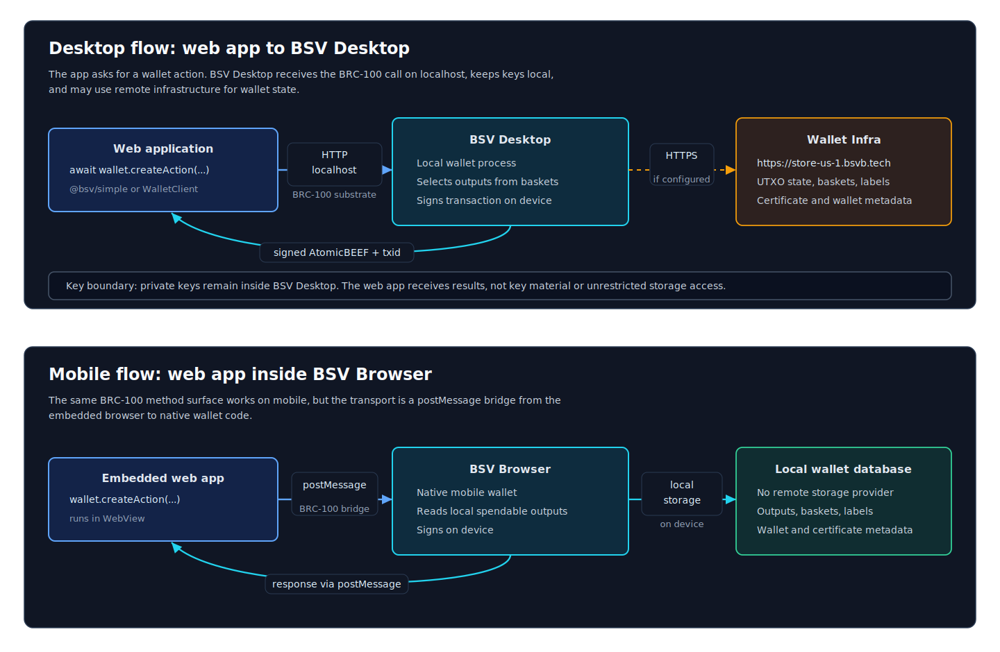

# Build a Wallet-Aware App

> Add wallet capabilities to a web app without putting private keys in the app. The app talks to a BRC-100 wallet; the wallet chooses spendable outputs, signs, and returns the result.

**Time:** ~15 minutes
**Prerequisites:** Node.js 20+, TypeScript, and a local BRC-100 wallet such as BSV Desktop or BSV Browser.



## What You Are Building

A browser app that can:

- connect to the user's wallet through `WalletClient`
- request the wallet identity key
- create a payment transaction
- create and list basket outputs
- drop down to raw BRC-100 methods when the helper layer is too small

For the complete method shapes, keep the [BRC-100 wallet interface](../specs/brc-100-wallet.md) open. It has linkable sections for [`createAction`](../specs/brc-100-wallet.md#createaction), [`signAction`](../specs/brc-100-wallet.md#signaction), [`listOutputs`](../specs/brc-100-wallet.md#listoutputs), and the other wallet methods.

## Step 1 - Install

```bash
npm install @bsv/sdk @bsv/simple
```

Use `@bsv/simple/browser` when you want ergonomic app helpers. Use `@bsv/sdk` directly when you need the full BRC-100 interface.

## Step 2 - Connect To The User Wallet

```typescript
import { WalletClient } from '@bsv/sdk'

const wallet = new WalletClient('auto', 'example.com')

const { publicKey } = await wallet.getPublicKey({
  identityKey: true
})

console.log('User identity key:', publicKey)
```

`'auto'` tries the supported wallet substrates for the runtime. On desktop, that can resolve to a local wallet service. In an embedded mobile browser, it can resolve through a postMessage-style bridge.

## Step 3 - Use The Simple Browser Helper

```typescript
import { createWallet } from '@bsv/simple/browser'

const appWallet = await createWallet()
const status = await appWallet.getStatus()

console.log(status.identityKey)
```

The simple helper is for common app workflows. It keeps the first integration small and still exposes the underlying BRC-100 client:

```typescript
const rawWallet = appWallet.getClient()
```

## Step 4 - Create A Payment

For identity-based payments, use the high-level helper:

```typescript
const result = await appWallet.pay({
  to: '025706528f0f6894b2ba505007267ccff1133e004452a1f6b72ac716f246216366',
  satoshis: 1000,
  description: 'Coffee'
})

console.log(result.txid)
```

For custom outputs, use `createAction` directly:

```typescript
import { P2PKH, PublicKey, WalletClient } from '@bsv/sdk'

const wallet = new WalletClient('auto', 'example.com')
const recipientIdentityKey = '025706528f0f6894b2ba505007267ccff1133e004452a1f6b72ac716f246216366'

const lockingScript = new P2PKH()
  .lock(PublicKey.fromString(recipientIdentityKey).toAddress())
  .toHex()

const action = await wallet.createAction({
  description: 'Pay recipient',
  outputs: [{
    satoshis: 1000,
    lockingScript,
    outputDescription: 'payment to recipient'
  }]
})

console.log(action.txid)
```

For ordinary wallet-selected inputs, `createAction` signs and processes the transaction by default. Use [`signAction`](../specs/brc-100-wallet.md#signaction) only when you deliberately create a signable action that needs custom unlocking scripts.

## Step 5 - Create And List Basket Outputs

Baskets are wallet-managed output groups. They are useful for app-owned tokens, tickets, receipts, and other spendable state.

```typescript
const token = await appWallet.createToken({
  basket: 'event tickets',
  satoshis: 1,
  data: {
    type: 'event-ticket',
    eventId: 'demo-2026'
  }
})

console.log(token.txid)
```

Use the raw BRC-100 client when you need exact output queries:

```typescript
const outputs = await appWallet.getClient().listOutputs({
  basket: 'event tickets',
  include: 'entire transactions',
  limit: 10
})

console.log(outputs.totalOutputs)
```

## Step 6 - Choose The Right Runtime

| Runtime | What The App Does | What The Wallet Does |
|---|---|---|
| BSV Desktop | App calls the wallet through the desktop substrate or localhost HTTP | Desktop wallet selects outputs, may use Wallet Infra, signs locally |
| BSV Browser | Embedded web app calls through a postMessage/native bridge | Mobile wallet selects outputs and signs on device |
| Server agent | Server code uses a service wallet | Server wallet signs with a configured private key and storage endpoint |
| Wallet implementation | Implements BRC-100 methods | Must match the interface and conformance vectors |

For server-side automation, use `@bsv/simple/server`:

```typescript
import { ServerWallet } from '@bsv/simple/server'

const wallet = await ServerWallet.create({
  privateKey: process.env.SERVER_PRIVATE_KEY!,
  network: 'main',
  storageUrl: 'https://store-us-1.bsvb.tech'
})
```

## When To Use Wallet-Toolbox

Most web apps should start with `@bsv/simple/browser` or `WalletClient`. Reach for [`@bsv/wallet-toolbox`](../packages/wallet/wallet-toolbox.md) when you are building wallet software, testing custom storage, or experimenting with signing/storage internals.

Wallet builders should also read:

- [BRC-100 Wallet Interface](../specs/brc-100-wallet.md)
- [Wallet Toolbox](../packages/wallet/wallet-toolbox.md)
- [Conformance Vector Catalog](../conformance/vectors.md)
