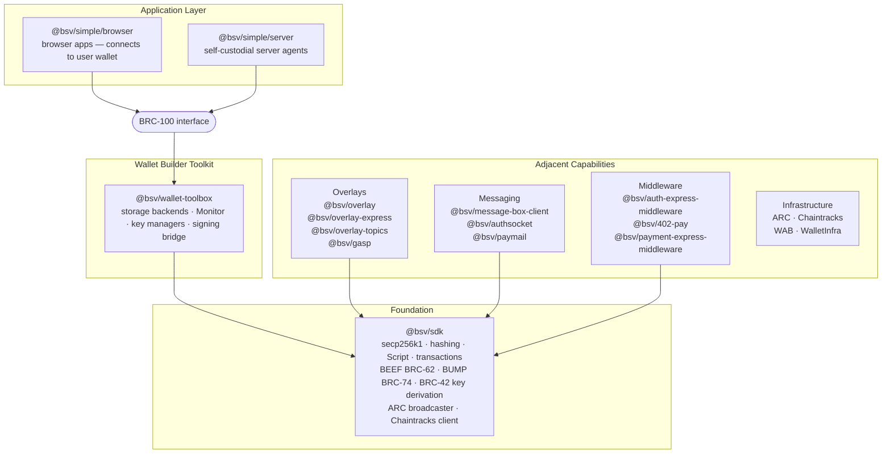

<div class="bsv-hero" markdown="0">
  <div class="bsv-hero__inner">
    <h1 class="bsv-hero__title">Unleash the potential of <em>data-on-chain</em></h1>
    <p class="bsv-hero__lede">
      A TypeScript stack for building apps that move money, store data, and authenticate users on BSV.
      27 packages covering crypto primitives, wallets, overlay networks, and HTTP middleware — wired
      together so you can ship in TypeScript without writing your own protocol code.
    </p>
    <a class="bsv-hero__cta" href="get-started/">
      Get started in 3 steps
      <span class="bsv-hero__cta-arrow" aria-hidden="true">&rarr;</span>
    </a>
  </div>
</div>

# ts-stack

## Architecture



## Domain Overview

| Domain | Packages | Description |
|--------|----------|-------------|
| **SDK** | 1 | Core cryptographic and transaction primitives for working with BSV |
| **Wallet** | 4 | Key management, balance tracking, and signing — local or via wallet service |
| **Network** | 1 | Broadcast transactions and query BSV nodes through a typed client |
| **Overlays** | 7 | Run and consume overlay services that index on-chain data (tokens, identities, files) |
| **Messaging** | 4 | Authenticated messages between identities using cryptographic signatures |
| **Middleware** | 3 | Drop-in Express middleware for payment-gating and identity verification |
| **Helpers** | 6 | Shared utilities, codecs, templates, and adapters |

## Quick Install

```bash
npm install @bsv/simple @bsv/sdk
```

Connect to a user's wallet and send a payment:

```typescript
import { createWallet } from '@bsv/simple/browser'

const wallet = await createWallet()
const result = await wallet.pay({
  to: recipientIdentityKey,
  satoshis: 1000,
})
console.log('txid:', result.txid)
```

For protocol-level work (keys, scripts, transactions, BEEF), use `@bsv/sdk` directly. See [Choose Your Stack](./get-started/choose-your-stack.md) for the full decision guide.

## What's Next?

- **[Get Started](./get-started/index.md)** — Connect a wallet and send your first payment
- **[Choose Your Stack](./get-started/choose-your-stack.md)** — Decision guide based on what you're building
- **[Package Index](./packages/index.md)** — Browse all 27 packages and their APIs
- **[Guides](./guides/index.md)** — Wallets, overlays, messaging, payments — how-to walkthroughs
- **[Specs](./specs/index.md)** — Protocol specifications for interoperability

## Features

- **27 production-ready packages** — From keys and signatures to wallets and overlays
- **100% TypeScript** — Full type safety across the stack
- **Monorepo architecture** — Packages work together seamlessly with shared dependencies
- **No protocol code to write** — BRC standards, BEEF format, SPV proofs already included
- **Enterprise patterns** — Message-signing, identity keys, access control middleware built-in
- **UHRP file storage** — Store and retrieve files on BSV through overlay topics
- **Multi-wallet support** — BRC-100 standard interface works with any BRC-100 wallet

## About ts-stack

ts-stack is maintained by the BSV blockchain community. The monorepo lives at [github.com/bsv-blockchain/ts-stack](https://github.com/bsv-blockchain/ts-stack).

See [Versioning](./about/versioning.md) for release cadence and [Contributing](./about/contributing.md) for how to report bugs or submit PRs.
