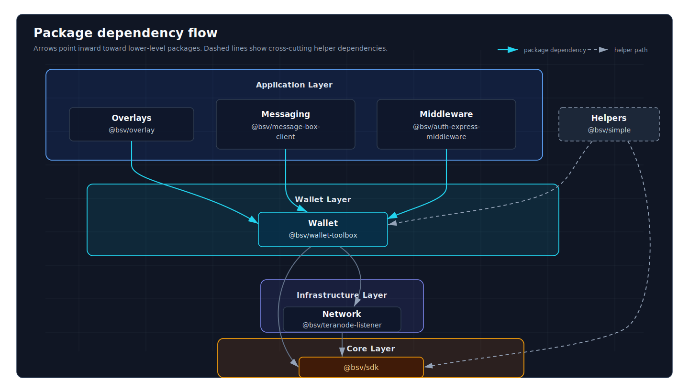

# Packages

ts-stack contains 27 production-ready packages organized into 7 domains. Each domain serves a specific part of the stack — from core crypto to business logic.

## Seven Domains

### SDK

**Core cryptographic and transaction primitives.** Every application starts here.

- [@bsv/sdk](./sdk/bsv-sdk.md) — Keys, signatures, transactions, BEEF, SPV

### Wallet

**Key management, balance tracking, signing — local or via wallet service.**

- [@bsv/wallet-toolbox](./wallet/wallet-toolbox.md) — BRC-100 wallet client library
- [@bsv/btms](./wallet/btms.md) — Basic Token Management System for token issuance, transfer, receiving, burning, and ownership proofs
- [@bsv/btms-permission-module](./wallet/btms-permission-module.md) — Token permission checking
- [@bsv/wallet-relay](./wallet/wallet-relay.md) — Broadcast and query wrapper for wallet synchronization

### Network

**Broadcast transactions and query BSV nodes through a typed client.**

- [@bsv/teranode-listener](./network/teranode-listener.md) — Connect to Teranode and listen for transactions

### Overlays

**Run and consume overlay services that index on-chain data.**

- [@bsv/overlay](./overlays/overlay.md) — Core overlay framework and transaction validation
- [@bsv/overlay-express](./overlays/overlay-express.md) — HTTP server for the Overlay spec
- [@bsv/overlay-topics](./overlays/overlay-topics.md) — Topic managers (UHRP, BTMS, custom)
- [@bsv/overlay-discovery-services](./overlays/overlay-discovery-services.md) — Discover overlays by service type
- [@bsv/gasp](./overlays/gasp.md) — GASP (Generic Append-only Structured Proofs) sync protocol
- [@bsv/btms-backend](./overlays/btms-backend.md) — Backend for running a token overlay

### Messaging

**Authenticated messages between identities using cryptographic signatures.**

- [@bsv/message-box-client](./messaging/message-box-client.md) — Send and retrieve messages from a message box service
- [@bsv/authsocket](./messaging/authsocket.md) — WebSocket protocol for authenticated messaging
- [@bsv/authsocket-client](./messaging/authsocket-client.md) — Client library for Authsocket
- [@bsv/paymail](./messaging/paymail.md) — Paymail protocol (payment address discovery)

### Middleware

**HTTP authentication and payment-gating packages.**

Authenticated Express middleware stack:

- [@bsv/auth-express-middleware](./middleware/auth-express-middleware.md) — Verify identity signatures in Express
- [@bsv/payment-express-middleware](./middleware/payment-express-middleware.md) — Gate authenticated Express routes behind payment requirements; requires `@bsv/auth-express-middleware`

Independent HTTP 402 flow:

- [@bsv/402-pay](./middleware/402-pay.md) — HTTP 402 payment handler designed to work without auth middleware

### Helpers

**Shared utilities, codecs, templates, and adapters.**

- [@bsv/templates](./helpers/templates.md) — Predefined `ScriptTemplate` examples for protocol engineers; `OpReturn` is one template among several
- [@bsv/did-client](./helpers/did-client.md) — DID resolver (Decentralized Identifiers)
- [@bsv/simple](./helpers/simple.md) — Simplified API for common operations
- [@bsv/wallet-helper](./helpers/wallet-helper.md) — Wallet utility functions
- [@bsv/amountinator](./helpers/amountinator.md) — Satoshi/BSV conversion and formatting
- [@bsv/fund-wallet](./helpers/fund-wallet.md) — Faucet integration for testnet/devnet

## Package Relationships



## Choosing Packages

See [Choose Your Stack](../get-started/choose-your-stack.md) for a decision guide based on what you're building.

## Installation

Most projects start with the SDK:

```bash
npm install @bsv/sdk
```

Then add packages as needed:

```bash
npm install @bsv/wallet-toolbox @bsv/overlay @bsv/authsocket
```

For monorepo development, see [Install](../get-started/install.md#using-ts-stack-in-a-monorepo).

## Package Stability

All packages in ts-stack are production-ready and versioned according to [Semantic Versioning](../about/versioning.md).

- **Stable** — API is locked, no breaking changes
- **Beta** — API may change, breaking changes possible
- **Experimental** — Early development, expect significant changes
- **Deprecated** — Sunset path defined, do not use in new projects

Check each package's documentation for its stability status.

## Next Steps

- **[SDK](./sdk/index.md)** — Start here
- **[Wallet](./wallet/index.md)** — Key management and signing
- **[Network](./network/index.md)** — Broadcast and query
- **[Overlays](./overlays/index.md)** — Run a service
- **[Messaging](./messaging/index.md)** — Authenticated messages
- **[Middleware](./middleware/index.md)** — Express integration
- **[Helpers](./helpers/index.md)** — Utilities and adapters
