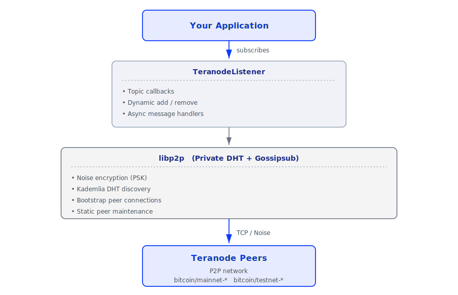

# Network

Connect to Teranode via private DHT and subscribe to real-time blockchain events (blocks, subtrees, mining updates).

## Packages in this Domain

| Package | Purpose |
|---------|---------|
| [@bsv/teranode-listener](./teranode-listener.md) | Subscribe to Teranode P2P topics via libp2p private DHT with gossipsub pub/sub messaging |

## What You Can Do

- **Listen for new blocks** — Real-time block solution events from Teranode
- **Monitor subtree updates** — Track subtree creation and validation
- **Track mining status** — Subscribe to mining enabled/disabled events
- **Monitor peer connections** — Handshake messages from connecting peers
- **Detect rejected transactions** — Receive txid of transactions rejected by network
- **Custom topic subscription** — Dynamic add/remove of topic callbacks at runtime
- **Private DHT participation** — Join closed, authenticated peer network with pre-shared key

## Key Concepts

- **Private DHT** — Uses pre-shared key (PSK) for secure, closed peer-to-peer network
- **Gossipsub** — Efficient pub/sub messaging layer for blockchain event distribution
- **Topic-based subscriptions** — Subscribe to specific events (bitcoin/mainnet-block, bitcoin/mainnet-subtree, etc.)
- **Bootstrap peers** — Known entry points for discovering other peers in the network
- **Static peers** — Explicitly configured peers maintained for reliable connectivity
- **Peer discovery** — libp2p Kademlia DHT discovers peers dynamically
- **Callbacks** — Each topic has own async message handler for processing events
- **Message format** — Events arrive as raw Uint8Array; caller deserializes (typically BSV transactions/blocks)

## When to Use

Use network packages when you need to:

- Monitor real-time blockchain events
- React to new blocks as they arrive
- Track peer connectivity and network health
- Run an overlay service that listens for transactions
- Build applications that need live blockchain state updates

## When NOT to Use

- For transaction broadcasting — use transaction submission endpoints
- For historical queries — use indexers or explorer APIs
- For UTXO lookups — use full-node RPC or @bsv/overlay lookup services
- Without requirement for real-time updates — use batch query APIs

## Architecture Overview

## Topics Available

| Topic | Event |
|-------|-------|
| `bitcoin/mainnet-bestblock` | Best block message |
| `bitcoin/mainnet-block` | Block solution found |
| `bitcoin/mainnet-subtree` | Subtree created |
| `bitcoin/mainnet-mining_on` | Mining enabled |
| `bitcoin/mainnet-handshake` | Peer connects |
| `bitcoin/mainnet-rejected_tx` | Transaction rejected |
| `bitcoin/testnet-*` | Testnet equivalents |

## Next Steps

- **[@bsv/teranode-listener](./teranode-listener.md)** — Real-time blockchain event subscription
- **[@bsv/overlay](../overlays/overlay.md)** — Indexing service integration
- **[@bsv/sdk](https://github.com/bsv-blockchain/ts-sdk)** — Transaction/block deserialization
