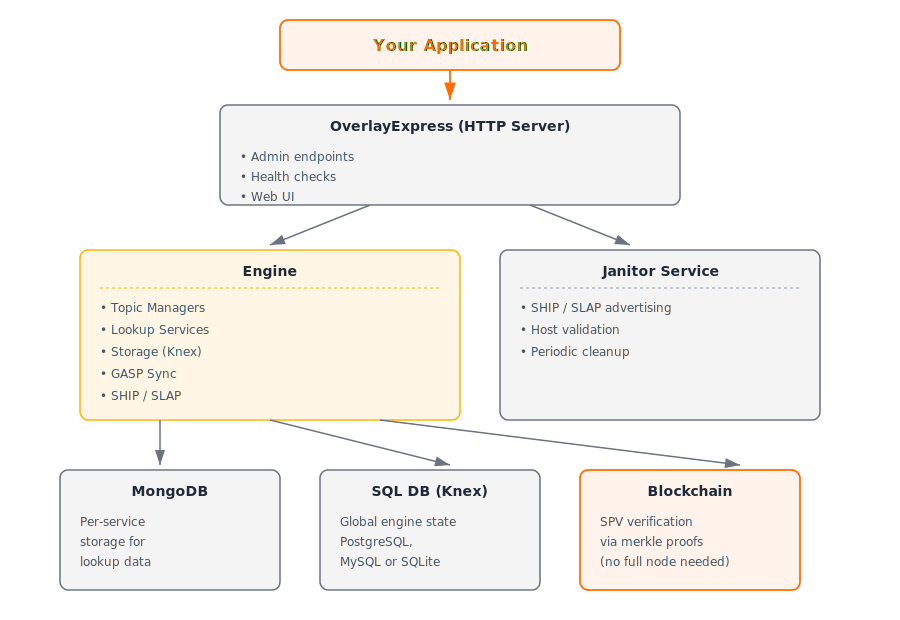

# Overlays

Build and operate overlay services that index, validate, and serve on-chain data through a modular architecture of topic managers and lookup services.

## Packages in this Domain

| Package | Purpose |
|---------|---------|
| [@bsv/overlay](./overlay.md) | Core Engine orchestrating topic managers, lookup services, and storage with BEEF/STEAK encoding |
| [@bsv/overlay-express](./overlay-express.md) | Opinionated Express.js HTTP server with configuration, health checks, and admin endpoints |
| [@bsv/overlay-topics](./topics.md) | 20+ pre-built topic managers and lookup services (BTMS, DID, KVStore, UHRP, UMP, Supply Chain, etc.) |
| [@bsv/overlay-discovery-services](./overlay-discovery-services.md) | SHIP/SLAP peer discovery and WalletAdvertiser for certificate-based advertisements |
| [@bsv/gasp](./gasp-core.md) | Graph Aware Sync Protocol for incremental transaction graph synchronization with SPV validation |
| [@bsv/btms-backend](./btms-backend.md) | BTMS token validation and indexing (legacy; core moved to @bsv/overlay-topics) |

## What You Can Do

- **Index transactions by topic** — Define custom admission logic via TopicManager interface
- **Query indexed data** — Efficient lookups of admitted UTXOs via LookupService interface
- **Peer discovery** — Advertise and discover overlay hosts and services via SHIP/SLAP
- **Sync state between nodes** — Incremental transaction graph synchronization with GASP
- **Deploy HTTP services** — Instant REST API via OverlayExpress with monitoring and web UI
- **Build token systems** — Pre-built BTMS topic for token issuance, transfer, and burning
- **Implement identity** — DID topic manager for decentralized identifiers
- **Key-value storage** — KVStore topic for protocol-agnostic data storage
- **File management** — UHRP topic for hash registry and file references

## When to Use

Use overlays when you need to:

- Run a service that validates and indexes a specific type of transaction
- Query indexed transaction data without scanning the entire blockchain
- Discover and communicate with other overlay nodes for state synchronization
- Build applications that depend on consistent indexing of on-chain data
- Implement custom business logic for transaction admission and querying

## Key Concepts

- **Overlay** — Service that indexes transactions matching a protocol (topic), validates them, and serves queries
- **Topic** — A category/protocol of transactions with specific format and validation rules
- **TopicManager** — Interface implementing admission logic (which outputs belong to this overlay)
- **LookupService** — Interface implementing indexing and query logic for admitted UTXOs
- **Engine** — Orchestrator combining topic managers, lookup services, storage, and networking
- **BEEF/STEAK** — Bitcoin-efficient transaction encoding (BEEF = input; STEAK = engine response)
- **SHIP/SLAP** — Peer discovery protocols (Service Host Interconnect Protocol / Service Lookup Availability Protocol)
- **GASP** — Graph-aware synchronization for sharing transaction ancestry and descendancy
- **AdmissionMode** — Whether lookup service receives locking-script details or full transaction
- **SpendNotificationMode** — How lookup service learns about spent UTXOs (none, txid-only, full script, whole-tx)

## Architecture Overview

## Next Steps

- **Start with [@bsv/overlay](./overlay.md)** — Understand the core Engine and interfaces
- **Deploy with [@bsv/overlay-express](./overlay-express.md)** — Quickly build HTTP overlay services
- **Use pre-built topics from [@bsv/overlay-topics](./topics.md)** — BTMS, DID, KVStore, and 17 more
- **Discover peers with [@bsv/overlay-discovery-services](./overlay-discovery-services.md)** — SHIP/SLAP for decentralized discovery
- **Sync state with [@bsv/gasp](./gasp-core.md)** — Keep multiple nodes in sync efficiently
- **[Guide: Run an Overlay Node](../../guides/run-overlay-node.md)** — Step-by-step deployment walkthrough
