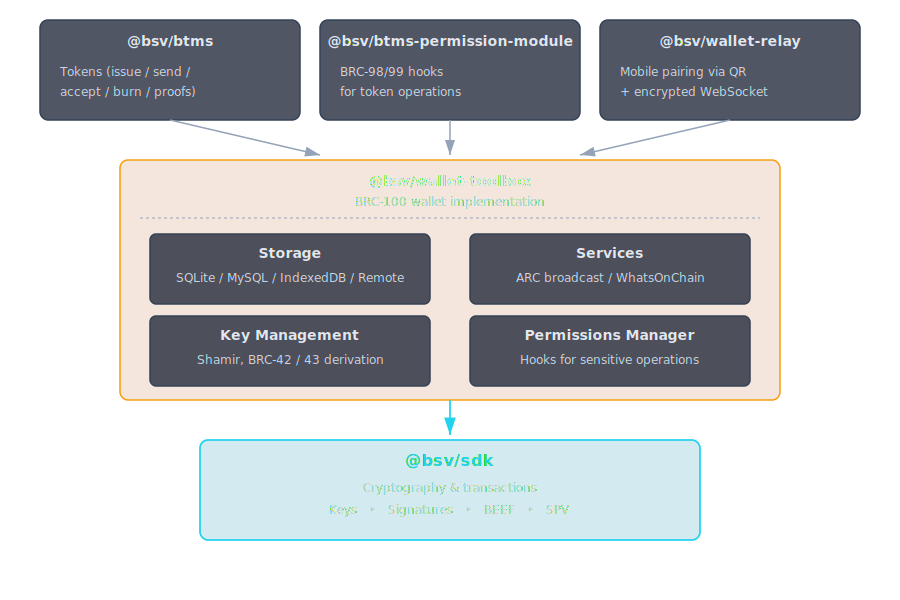

# Wallet Domain

Higher-layer packages for key management, balance tracking, transaction signing, token operations, and mobile wallet pairing. These packages provide persistent state, BRC-100 wallet implementation, and framework-agnostic permission systems.

The wallet domain builds on top of [@bsv/sdk](../sdk/bsv-sdk.md). If you only need transaction building without persistent state or key management, use the SDK directly. If you need full wallet functionality with storage, key derivation, background monitoring, or token support, use packages from this domain.

## Packages in this Domain

| Package | Purpose |
|---------|---------|
| [@bsv/wallet-toolbox](./wallet-toolbox.md) | Reference BRC-100 wallet implementation with SQLite/MySQL/IndexedDB storage, background monitoring, Shamir key sharing, and permission management |
| [@bsv/btms](./btms.md) | UTXO-based token issuance, transfer, burning, and ownership proof validation |
| [@bsv/btms-permission-module](./btms-permission-module.md) | Framework-agnostic BRC-98/99 permission hooks for BTMS token spending with custom UI callback |
| [@bsv/wallet-relay](./wallet-relay.md) | Mobile-to-desktop wallet pairing via QR codes and encrypted WebSocket relay with React components |

## Common Use Cases

### I'm building an app and need user signatures
Use [@bsv/wallet-toolbox](./wallet-toolbox.md) to create a full wallet with persistent storage and signing, or integrate with user-installed wallets via the BRC-100 interface.

### I'm building a web app that integrates with user wallets
Use [@bsv/wallet-toolbox](./wallet-toolbox.md) for local wallet, or [@bsv/wallet-relay](./wallet-relay.md) for mobile wallet pairing via QR code.

### I need to issue and manage tokens
Use [@bsv/btms](./btms.md) for token operations (issue, send, accept, burn). Integrate with [@bsv/wallet-toolbox](./wallet-toolbox.md) for wallet signing and [@bsv/btms-permission-module](./btms-permission-module.md) for permission control.

### I'm building a wallet application myself
Use [@bsv/wallet-toolbox](./wallet-toolbox.md) as reference implementation. It demonstrates BRC-100 compliance, storage abstraction, key management, and background monitoring patterns.

### I need mobile-to-desktop signing without downloading wallet software
Use [@bsv/wallet-relay](./wallet-relay.md) for QR pairing. Desktop shows QR, mobile scans, then mobile wallet signs and relays responses back encrypted.

### I want fine-grained permission control over token operations
Use [@bsv/btms-permission-module](./btms-permission-module.md) with your custom permission handler (modal, alert, web component, etc.).

## Key Concepts

- **BRC-100 Wallet Interface** — Standard interface implemented by all wallet packages. Apps can work with any wallet (desktop, mobile, hardware) without code changes.
- **Action** — High-level transaction intent. App specifies outputs; wallet picks inputs internally for privacy and flexibility.
- **SignableTransaction** — Opaque reference to a created action. App requests wallet to sign this reference; wallet handles ECDSA signing.
- **Storage Backend** — Pluggable abstraction layer. Same wallet code works with SQLite (Node.js), IndexedDB (browser), or remote HTTPS server.
- **Key Derivation** — BRC-42/43 hierarchical key generation. Each protocol can request keys from wallet without exposing root key.
- **Monitor** — Background daemon that polls blockchain for transaction confirmations, acquires merkle proofs, and rebroadcasts stalled transactions.
- **BTMS Token** — UTXO-based token identified by canonical asset ID (`{txid}.{vout}`). Each token is a separate on-chain output with metadata.
- **Ownership Proof** — Cryptographic proof of token ownership without revealing private key. Used for collateral, escrow, access control.
- **Relay Session** — Encrypted tunnel between desktop and mobile wallet. QR encodes relay URL + session ID; mobile scans and establishes WebSocket connection.
- **Permission Module** — BRC-98/99 hooks that intercept special operations (token spend, burn) and prompt user via custom callback.

## Architecture Overview

## Storage & Platform Support

| Package | Node.js | Browser | Mobile |
|---------|---------|---------|--------|
| **wallet-toolbox** | SQLite, MySQL | IndexedDB, Remote | IndexedDB, Remote |
| **btms** | ✓ | ✓ | ✓ |
| **btms-permission-module** | ✓ | ✓ | ✓ |
| **wallet-relay** | Server | React components | Supported via relay |

## When to Use Each Package

### Wallet Toolbox
- You're building a wallet application
- You need persistent transaction history and UTXO state
- You want BRC-100 compliance
- You need key derivation for multiple protocols
- You want background transaction monitoring
- You need different storage for different platforms

### BTMS
- You're building token issuance/transfer system
- You need UTXO-based tokens with on-chain metadata
- You want automated PushDrop encoding/decoding
- You need ownership proofs for collateral/escrow

### BTMS Permission Module
- You want user approval for token operations
- You need framework-agnostic permission callbacks
- You're building a wallet with permission control
- You want custom UI for permission prompts

### Wallet Relay
- You're building a web app needing mobile signatures
- You want QR-based pairing (no software download)
- You need encrypted communication over untrusted networks
- You want stateless session management

### NOT for these
- Don't use wallet packages if you only need transaction building — use [@bsv/sdk](../sdk/bsv-sdk.md) directly
- Don't use wallet-toolbox if you only need BRC-100 interface types — import from SDK instead

## Next Steps

- **[@bsv/wallet-toolbox](./wallet-toolbox.md)** — Full wallet implementation
- **[@bsv/btms](./btms.md)** — Token protocol
- **[@bsv/wallet-relay](./wallet-relay.md)** — Mobile pairing
- **[@bsv/btms-permission-module](./btms-permission-module.md)** — Token permissions
- **[SDK Domain](../sdk/index.md)** — Cryptography and transactions
