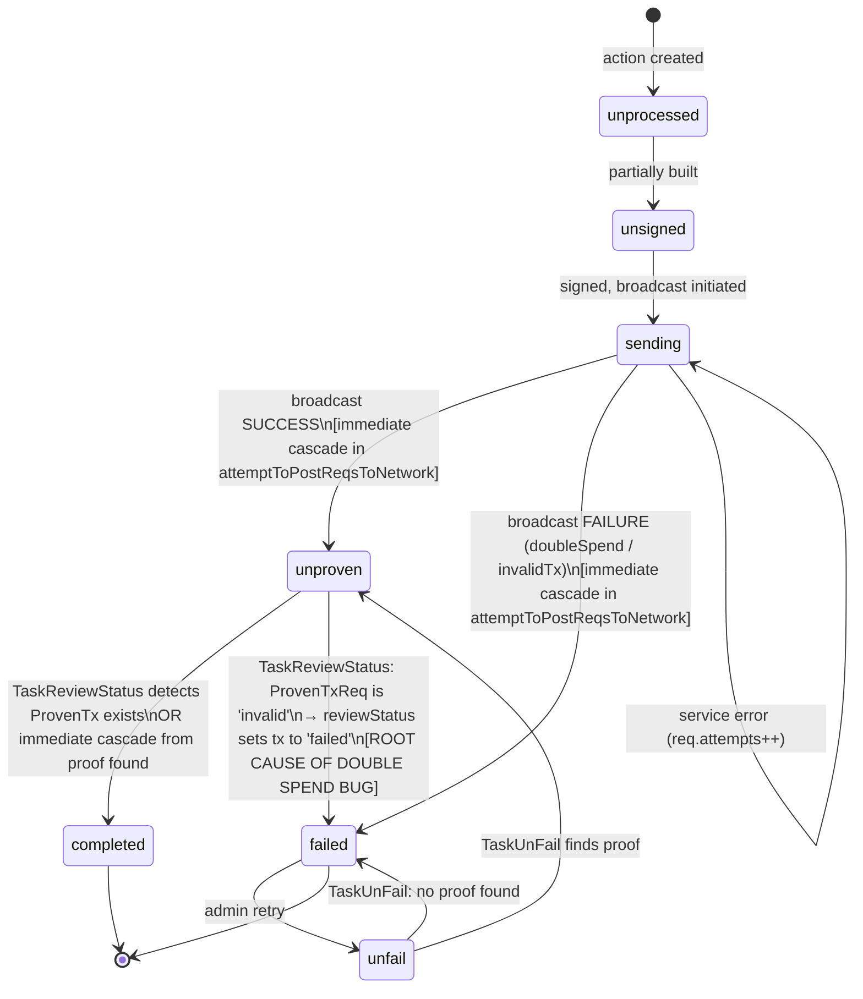

# Current State: Transaction Monitoring and Status Management (TypeScript)

## Overview

This document describes the current behavior of the TypeScript wallet-toolbox monitor tasks and transaction status lifecycle as of analysis performed on 2026-04-30. It covers how transactions move through states, the full task inventory, the `reviewStatus` cascade that the Go implementation is missing, and where the current implementation fails under adversarial network conditions.

---

## Architecture

### Dual-Layer Status Model

| Layer | Table | Type | Purpose |
|---|---|---|---|
| **ProvenTxReq** | `proven_tx_reqs` | `ProvenTxReqStatus` | Broadcast and proof-retrieval tracking. Holds `rawTx`, `inputBEEF`, and `notify.transactionIds`. |
| **Transaction** | `transactions` | `TransactionStatus` | User-facing wallet action state. Links to ProvenTx when confirmed. |

These layers are loosely coupled. Changes in ProvenTxReq status propagate to Transaction status via two mechanisms:
1. **Immediate cascade** — at broadcast time in `attemptToPostReqsToNetwork.ts`
2. **Periodic reconciliation** — `TaskReviewStatus` runs every 15 minutes to catch anything missed

---

## Monitor Task Inventory

| Task | Default Interval | Trigger | Key Behavior |
|---|---|---|---|
| `TaskClock` | 1s | timer | Drives other task triggers |
| `TaskNewHeader` | 1 min | timer | Polls chaintracks for new block; sets `TaskCheckForProofs.checkNow = true` |
| `TaskSendWaiting` | 8s | timer (7s age filter) | Broadcasts `unsent`/`sending` ProvenTxReqs; cascades tx status immediately |
| `TaskCheckForProofs` | on `checkNow` flag (fallback: 2h) | `TaskNewHeader` sets flag | Fetches Merkle proofs; marks `invalid` after max attempts |
| `TaskCheckNoSends` | 1 day | timer | Checks `nosend` txs that may have been mined externally |
| `TaskFailAbandoned` | 8 min | timer | Marks `unprocessed`/`unsigned` Transactions failed after 5-min age threshold |
| `TaskUnFail` | 10 min | timer or `checkNow` flag | Processes `unfail` ProvenTxReqs: find proof → `unmined`; else → `invalid` |
| `TaskReviewStatus` | 15 min | timer | Cascades: invalid req → failed tx → spendable inputs; completed proof → completed tx |
| `TaskReorg` | event | chaintracks reorg event | Updates proofs for orphaned blocks |
| `TaskReviewDoubleSpends` | 12 min | timer | Reviews `doubleSpend` terminal reqs; moves false positives to `unfail` |
| `TaskReviewProvenTxs` | 10 min | timer | Validates existing proofs against current canonical chain |
| `TaskArcSSE` | continuous | ARC SSE stream | Real-time status updates: SENT, ACCEPTED, MINED, DOUBLE_SPEND, REJECTED |
| `TaskReviewUtxos` | manual | `runTask` | Validates UTXO set against `isUtxo()` service call |
| `TaskPurge` | 6h | timer | Deletes aged failed/completed transaction data |
| `TaskMonitorCallHistory` | internal | timer | Rotates service call history for monitoring |

---

## ProvenTxReq Finite State Machine — Current Behavior

```mermaid
stateDiagram-v2
    [*] --> unprocessed : tx created
    unprocessed --> unsent : queued for delayed broadcast
    unprocessed --> sending : broadcast initiated (immediate)
    unsent --> sending : TaskSendWaiting picks up (age >= 7s)
    sending --> unsent : delayed (batched)

    sending --> unmined : broadcast SUCCESS (no callback service)
    sending --> callback : broadcast SUCCESS (with callback service)
    callback --> unconfirmed : proof received but not yet confirmed by chaintracks
    unconfirmed --> completed : chaintracks confirms proof
    unmined --> completed : MerklePath found + validated

    sending --> doubleSpend : broadcast REJECTED – double spend
    sending --> invalid : broadcast REJECTED – invalid tx\n(script error, missing rawTx, etc.)
    sending --> sending : service error – attempts++

    unmined --> invalid : attempts > unprovenAttemptsLimitTest (10)\n  OR attempts > unprovenAttemptsLimitMain (144)\n[BUG: should rebroadcast instead]
    unmined --> invalid : rawTx doesn't hash to txid (structural)

    invalid --> unfail : admin sets status='unfail'\nOR TaskReviewDoubleSpends moves false positive doubleSpend → unfail
    unfail --> unmined : MerklePath found; attempts reset to 0
    unfail --> invalid : MerklePath NOT found

    doubleSpend --> unfail : TaskReviewDoubleSpends detects false positive\n(tx is known to network)
    doubleSpend --> [*] : terminal (confirmed true double spend)
    completed --> [*] : terminal

    unmined --> reorg : chaintracks orphan event
    reorg --> unmined : TaskReorg re-queues
```



**Attempt limits** (`Monitor.ts:105-106`):
- `unprovenAttemptsLimitTest = 10` — testnet: 10 failed proof checks before `invalid`
- `unprovenAttemptsLimitMain = 144` — mainnet: ~1 day of blocks before `invalid`

**Secondary invalid check** (`EntityProvenTx.fromReq()` line 291):
- Also marks `invalid` if `attempts > 8` AND age > 60 minutes. This secondary check fires in the proof-construction path.

---

## Transaction Finite State Machine — Current Behavior



---

## The `reviewStatus` Cascade (Three-Step SQL Process)

**File:** `src/storage/methods/reviewStatus.ts`, lines 19-95  
**Triggered by:** `TaskReviewStatus` every 15 minutes

**Step 1 — Propagate `invalid` → `failed`** (lines 43-57):
```sql
UPDATE transactions SET status = 'failed'
WHERE status != 'failed'
  AND EXISTS (
    SELECT 1 FROM proven_tx_reqs r
    WHERE transactions.txid = r.txid AND r.status = 'invalid'
  )
```

**Step 2 — Restore spendability of inputs** (lines 59-72):
```sql
UPDATE outputs SET spentBy = null, spendable = true
WHERE EXISTS (
  SELECT 1 FROM transactions t
  WHERE outputs.spentBy = t.transactionId AND t.status = 'failed'
)
```

**Step 3 — Propagate proof → `completed`** (lines 74-90):
```sql
UPDATE transactions SET status = 'completed', provenTxId = (SELECT provenTxId FROM proven_txs p WHERE transactions.txid = p.txid)
WHERE provenTxId IS NULL
  AND EXISTS (SELECT 1 FROM proven_txs p WHERE transactions.txid = p.txid)
```

**Critical observation:** Step 2 restores ALL inputs (outputs where `spentBy` = failed tx). It makes no distinction between:
- Inputs of a transaction that was NEVER broadcast (correct to restore)
- Inputs of a transaction that WAS broadcast and is still in mempool (INCORRECT to restore — causes double spend)

---

## Broadcast Cascade (Immediate)

**File:** `src/storage/methods/attemptToPostReqsToNetwork.ts`, lines 226-263

When broadcast completes (success OR failure), `updateTransactionsStatus` is called immediately:

| Broadcast outcome | ProvenTxReq status | Transaction status | Input spendability |
|---|---|---|---|
| Success | `unmined` | `unproven` | consumed (remain spent) |
| Double spend | `doubleSpend` | `failed` | restored (via updateTransactionsStatus) |
| Invalid tx | `invalid` | `failed` | restored (via updateTransactionsStatus) |
| Service error | `sending` | `sending` | unchanged |

---

## UTXO Lifecycle

| Event | Input UTXOs | Change/Output UTXOs |
|---|---|---|
| Tx broadcast SUCCESS | `spentBy` set, `spendable=false` | Not yet created |
| Broadcast fails: `doubleSpend`/`invalid` | Restored immediately (`spendable=true, spentBy=null`) | Cleaned up |
| ProvenTxReq → `invalid` (proof timeout) | **NOT restored immediately** | Remain as-is |
| `reviewStatus` runs (15 min later) | **RESTORED** (`spendable=true, spentBy=null`) | Cleaned up if tx → failed |
| ProvenTx found (tx confirmed) | Stay consumed | `spendable` updated |
| TaskUnFail succeeds | Re-marked as `spentBy` this tx | `spendable` set via `isUtxo()` check |

---

## The Adversarial Miner Double Spend Scenario (TS)

**Timeline** (testnet blocks 1732666–1732683):

```
T0   Txs broadcast → ProvenTxReq: unmined, Transaction: unproven
     inputs consumed (spentBy set, spendable=false)

T1   Block 1732666 mined (empty) → TaskNewHeader fires → TaskCheckForProofs runs
     MerklePath returns nil → attempts++ (attempts=1)

T2-T10  9 more empty blocks → attempts increments each block

T10  Block 1732676 mined (empty) → TaskCheckForProofs runs
     attempts=10 → exceeds unprovenAttemptsLimitTest=10
     → ProvenTxReq status = 'invalid'

≤T10+15min  TaskReviewStatus runs (15-min interval):
     Step 1: Transaction → 'failed' (ProvenTxReq is 'invalid')
     Step 2: outputs.spendable=true, spentBy=null  ← INPUT UTXOs RESTORED
     Wallet now sees original inputs as spendable again!

T11  Wallet creates TX2 spending the "restored" inputs (same UTXOs as TX1)

T17  Block 1732683 mined by GorillaNode (includes TX1 from mempool)
     TX1 is now confirmed on-chain

T18  Wallet tries to broadcast TX2 → ARC rejects: DOUBLE SPEND
     Or: TX2 was already broadcast and both TX1 and TX2 are in mempool
     → whichever miner includes TX1 causes TX2 to be a double spend
```

**Root cause:** `reviewStatus` Step 2 does not distinguish between inputs of a never-broadcast transaction and inputs of a transaction that is still live in the mempool.

---

## Summary of Deficiencies

| # | Issue | Location |
|---|---|---|
| 1 | `unprovenAttemptsLimitTest = 10` too small for adversarial empty-block miners | `Monitor.ts:105` |
| 2 | `reviewStatus` Step 2 restores inputs without checking if ProvenTxReq was ever broadcast | `reviewStatus.ts:59-72` |
| 3 | No rebroadcast when proof check times out — tx is abandoned in mempool | `TaskCheckForProofs.ts:154-165` |
| 4 | No distinction between "never broadcast" and "broadcast but not yet mined" in invalid handling | `reviewStatus.ts` |
| 5 | `TaskReviewDoubleSpends` only triggers for `doubleSpend` status, not for `invalid` | `TaskReviewDoubleSpends.ts` |
| 6 | Secondary invalid check in `EntityProvenTx.fromReq()` (attempts > 8, age > 60 min) fires earlier than `unprovenAttemptsLimitTest=10` on some code paths | `EntityProvenTx.ts:291` |

---

## Key Differences vs Go Implementation

| Aspect | TypeScript | Go |
|---|---|---|
| `reviewStatus` cascade | **EXISTS** — runs every 15 min | **MISSING** — TODO comment only |
| Input restoration | Via `reviewStatus` Step 2 (after 15 min) | Not implemented |
| Attempt limit (testnet) | `unprovenAttemptsLimitTest = 10` | `MaxAttempts = 10` |
| Attempt limit (mainnet) | `unprovenAttemptsLimitMain = 144` | `MaxAttempts = 10` (no chain distinction) |
| Rebroadcast on timeout | Not implemented | Not implemented |
| `TaskReviewDoubleSpends` | **EXISTS** | Missing |
| `TaskArcSSE` | **EXISTS** | Missing |
| `TaskReviewProvenTxs` | **EXISTS** | Missing |
| `TaskSendWaiting` interval | 8 seconds | 5 minutes |
| Double spend verification | `confirmDoubleSpend()` with 3 retries + `isUtxo()` check | Direct result from broadcast only |
