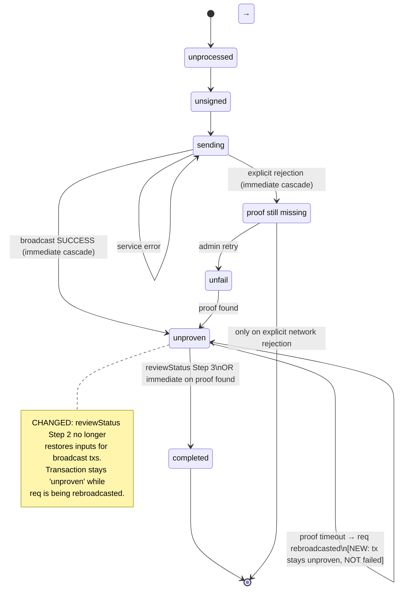

# Planned Changes: Robust Transaction Status Recovery (TypeScript)

## Problem Statement

Unlike the Go implementation (which never implemented the `reviewStatus` cascade), the TypeScript implementation DOES cascade ProvenTxReq `invalid` → Transaction `failed` → inputs restored to spendable. This cascade is correct for transactions that were never broadcast. However, it is **incorrect for transactions that were successfully broadcast** and are still live in the mempool.

The consequence: a valid transaction waiting in the mempool for 10+ blocks (adversarial empty-block miner scenario) triggers `reviewStatus` which restores its inputs to spendable. The wallet then creates a new transaction spending those same inputs. When the original transaction is eventually mined, the new transaction becomes a double spend — causing an unrecoverable error loop.

**Core principle:** A ProvenTxReq that reached `unmined` status was successfully broadcast and accepted by the network. Its inputs must not be restored to spendable until there is explicit proof that the transaction has been rejected or superseded on-chain.

---

## Root Cause Analysis

| Cause | File | Location |
|---|---|---|
| `unprovenAttemptsLimitTest = 10` — far too small for adversarial block conditions | `Monitor.ts` | line 105 |
| `reviewStatus` Step 2 restores inputs for ALL failed txs, including broadcast ones | `reviewStatus.ts` | lines 59-72 |
| No rebroadcast when proof check times out | `TaskCheckForProofs.ts` | lines 154-165 |
| `EntityProvenTx.fromReq()` has an independent earlier invalid threshold (attempts > 8, age > 60 min) | `EntityProvenTx.ts` | line 291 |
| No secondary confirmation before marking a broadcast tx as invalid | `TaskCheckForProofs.ts` | lines 154-165 |

---

## Proposed Changes

### Change 1 — Increase `unprovenAttemptsLimitTest` and Introduce Rebroadcast

**Current (`TaskCheckForProofs.ts:154-165`):**
```typescript
if (!ignoreStatus && req.attempts > limit) {
  req.status = 'invalid'
  await req.updateStorageDynamicProperties(task.storage)
  invalid.push(reqApi)
  continue
}
```

**Proposed:**
```typescript
if (!ignoreStatus && req.attempts > limit) {
  // Only mark invalid if the req was never broadcast (never reached 'unmined')
  // Broadcast txs that timed out should be rebroadcasted, not abandoned
  if (req.hadStatus('unmined')) {
    // Was broadcast — reset to unsent for rebroadcast
    req.status = 'unsent'
    req.attempts = 0
    req.rebroadcastAttempts = (req.rebroadcastAttempts || 0) + 1
    if (maxRebroadcastAttempts > 0 && req.rebroadcastAttempts >= maxRebroadcastAttempts) {
      req.status = 'invalid'
    }
  } else {
    // Was never successfully broadcast — correctly invalid
    req.status = 'invalid'
  }
  await req.updateStorageDynamicProperties(task.storage)
  continue
}
```

This requires tracking status history on the req. Since `history` (JSON) is already stored on ProvenTxReq, a `hadStatus(s)` helper can check whether the req was ever in a given state.

Alternative simpler approach: add a `wasBroadcast: boolean` flag to ProvenTxReq, set `true` when status first transitions to `unmined` or `callback`.

**Config additions to `MonitorOptions`:**
```typescript
unprovenAttemptsLimitTest: number     // default 10 → INCREASE to 100 or more
unprovenAttemptsLimitMain: number     // default 144 → keep or increase
maxRebroadcastAttempts: number        // new: 0 = unlimited, default 0
```

### Change 2 — Fix `reviewStatus` Step 2: Don't Restore Inputs for Broadcast Txs

**Current (`reviewStatus.ts:59-72`):**
```sql
UPDATE outputs SET spentBy = null, spendable = true
WHERE EXISTS (
  SELECT 1 FROM transactions t
  WHERE outputs.spentBy = t.transactionId AND t.status = 'failed'
)
```

**Problem:** This restores inputs for ALL failed transactions regardless of whether they were broadcast.

**Proposed:**
```sql
UPDATE outputs SET spentBy = null, spendable = true
WHERE EXISTS (
  SELECT 1 FROM transactions t
  WHERE outputs.spentBy = t.transactionId
    AND t.status = 'failed'
    AND NOT EXISTS (
      SELECT 1 FROM proven_tx_reqs r
      WHERE r.txid = t.txid AND r.status IN ('unmined', 'callback', 'unconfirmed', 'sending')
    )
    -- Only restore if no live ProvenTxReq exists for this txid
    -- A live ProvenTxReq means the tx may still be in mempool
)
```

Or more conservatively, add a `wasEverBroadcast` column to transactions (set to `true` when status first moves to `unproven`) and filter on that:

```sql
UPDATE outputs SET spentBy = null, spendable = true
WHERE EXISTS (
  SELECT 1 FROM transactions t
  WHERE outputs.spentBy = t.transactionId
    AND t.status = 'failed'
    AND (t.wasEverBroadcast IS NULL OR t.wasEverBroadcast = false)
)
```

This ensures only inputs from transactions that were NEVER accepted by the network are restored.

### Change 3 — Fix `EntityProvenTx.fromReq()` Secondary Invalid Threshold

**Current (`EntityProvenTx.ts:291`):**
```typescript
if (req.attempts > EntityProvenTx.getProofAttemptsLimit && ageInMinutes > EntityProvenTx.getProofMinutes) {
  req.status = 'invalid'
}
```

This fires for `attempts > 8 AND age > 60 min` — it can bypass the `unprovenAttemptsLimitTest` setting entirely for reqs that reach `unmined` status. The same broadcast-check logic from Change 1 must be applied here.

**Proposed:**
```typescript
if (req.attempts > EntityProvenTx.getProofAttemptsLimit && ageInMinutes > EntityProvenTx.getProofMinutes) {
  if (req.wasBroadcast) {
    req.status = 'unsent'  // rebroadcast path
    req.attempts = 0
  } else {
    req.status = 'invalid'  // never broadcast, correctly invalid
  }
}
```

### Change 4 — Mark Reqs as "Was Broadcast" at Transition to `unmined`

This is the enabling change for Changes 1–3. When a ProvenTxReq first transitions to `unmined` or `callback`, set a `wasBroadcast` flag. This can be stored in:
- A new `was_broadcast` boolean column on `proven_tx_reqs`, OR
- The existing `history` JSON field (check if `history` contains any `unmined` or `callback` state entry)

The JSON-history approach avoids a schema migration:
```typescript
// Helper method on EntityProvenTxReq
get wasBroadcast (): boolean {
  const h = this.apiHistory || []
  return h.some(note => note.status === 'unmined' || note.status === 'callback')
}
```

---

## Proposed ProvenTxReq Finite State Machine

```mermaid
stateDiagram-v2
    [*] --> unprocessed : tx created
    unprocessed --> unsent : queued
    unsent --> sending : TaskSendWaiting

    sending --> unmined : broadcast SUCCESS
    sending --> callback : broadcast SUCCESS + callback service
    callback --> unconfirmed : proof received pending chaintracks
    unconfirmed --> completed : chaintracks confirms

    sending --> doubleSpend : explicit double spend from network
    sending --> invalid : explicit invalid tx (structural, script)
    sending --> sending : service error – attempts++

    unmined --> completed : MerklePath found ✓

    unmined --> unsent : attempts > limit\n[PROPOSED: rebroadcast, NOT invalidate]\nwasBroadcast=true → reset attempts, status='unsent'

    note right of unmined
        NEW: proof timeout → rebroadcast cycle
        unsent → TaskSendWaiting → sending → unmined
        Repeats until confirmed OR maxRebroadcastAttempts hit
    end note

    unmined --> invalid : maxRebroadcastAttempts exceeded\n(circuit breaker, default unlimited)

    invalid --> unfail : admin override
    unfail --> unmined : MerklePath found; attempts=0
    unfail --> invalid : MerklePath not found

    doubleSpend --> unfail : TaskReviewDoubleSpends: false positive detected
    doubleSpend --> [*] : confirmed true double spend

    completed --> [*]
    invalid --> [*] : only if never broadcast OR circuit breaker hit
```



## Proposed Transaction Finite State Machine



---

## Implementation Plan

### Phase 1 — Immediate Safety Fix (No Schema Change)

**Files:**
- `src/monitor/Monitor.ts`
- `src/monitor/tasks/TaskCheckForProofs.ts`
- `src/storage/methods/reviewStatus.ts`

**Changes:**
1. In `Monitor.ts`: Increase `unprovenAttemptsLimitTest` default to 100 (or a configurable value that represents a reasonable mempool wait — ~24h of testnet blocks).
2. In `TaskCheckForProofs.ts` (`getProofs` function, line 158): Before marking as `invalid`, check `req.history` to see if the req ever had status `unmined` or `callback`. If yes, reset to `unsent` + `attempts = 0` instead of marking `invalid`.
3. In `reviewStatus.ts` Step 2: Add a subquery to exclude txs whose `txid` has a live ProvenTxReq (`status IN ('unmined', 'callback', 'unconfirmed', 'sending')`). This prevents restoring inputs for txs that are still in mempool.

### Phase 2 — Schema Migration (Persistent `wasBroadcast` Flag)

**Files:**
- `src/storage/schema/tables/TableProvenTxReq.ts`
- Knex migration file

**Changes:**
1. Add `was_broadcast BOOLEAN DEFAULT false` column to `proven_tx_reqs` table.
2. Set `was_broadcast = true` in `updateReqsFromAggregateResults` when transitioning to `unmined` or `callback`.
3. Replace the `history`-based `wasBroadcast` check in Phase 1 with the new column.
4. Add `rebroadcast_attempts INTEGER DEFAULT 0` column for circuit breaker support.

### Phase 3 — Fix `EntityProvenTx.fromReq()` Secondary Threshold

**File:** `src/storage/schema/entities/EntityProvenTx.ts` (line 291)

Apply the same `wasBroadcast` check: if the req was broadcast, reset to `unsent`; if not, keep `invalid`.

### Phase 4 — Configurable Circuit Breaker

Add `maxRebroadcastAttempts` to `MonitorOptions` (default `0` = unlimited). When the rebroadcast counter reaches this limit, allow `invalid` to be set even for broadcast txs. This is a safety valve for long-running stuck transactions.

---

## `reviewStatus` Updated Logic

After Phase 1-2, `reviewStatus.ts` becomes:

```typescript
// Step 1 — unchanged: detect invalid reqs and mark their txs failed
// (only fires for reqs where invalid means "was never successfully broadcast")

// Step 2 — MODIFIED: restore inputs only for non-broadcast txs
UPDATE outputs SET spentBy = null, spendable = true
WHERE EXISTS (
  SELECT 1 FROM transactions t
  WHERE outputs.spentBy = t.transactionId
    AND t.status = 'failed'
    -- Only restore if no live broadcast-stage ProvenTxReq still exists
    AND NOT EXISTS (
      SELECT 1 FROM proven_tx_reqs r
      WHERE r.txid = t.txid
        AND r.status IN ('unmined', 'callback', 'unconfirmed', 'sending', 'unsent')
    )
)

// Step 3 — unchanged: set completed where ProvenTx exists
```

---

## Invariants After Changes

1. **A transaction with a live ProvenTxReq (`unmined`, `callback`, `sending`) must never have its inputs restored.** The inputs are consumed by a valid on-chain transaction that may still be mined.

2. **Proof timeout → rebroadcast, not invalidation.** The absence of a Merkle proof after N blocks means the tx has not been mined yet — not that it is invalid.

3. **`invalid` is a terminal state reserved for explicit network rejection.** Structural errors (rawTx doesn't hash to txid), script validation failures, and explicit ARC rejection are the only valid paths to `invalid` for broadcast transactions.

4. **`reviewStatus` Step 2 must be safe to run at any time.** It should be idempotent and must not accidentally restore inputs for live mempool transactions.

---

## Configuration Recommendations

| Setting | Current Default | Recommended | Rationale |
|---|---|---|---|
| `unprovenAttemptsLimitTest` | 10 | 100 | ~24h of testnet blocks |
| `unprovenAttemptsLimitMain` | 144 | 288 | ~48h of mainnet blocks, gives more buffer |
| `maxRebroadcastAttempts` | N/A (new) | 0 (unlimited) | Never give up on a broadcast tx |
| `TaskReviewStatus` interval | 15 min | 15 min | Keep |
| `TaskSendWaiting` interval | 8s | 8s | Keep — critical for rebroadcast path |
| `TaskReviewDoubleSpends` interval | 12 min | 12 min | Keep |
